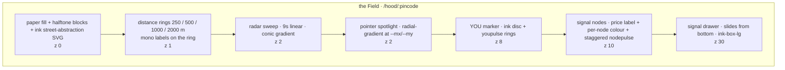
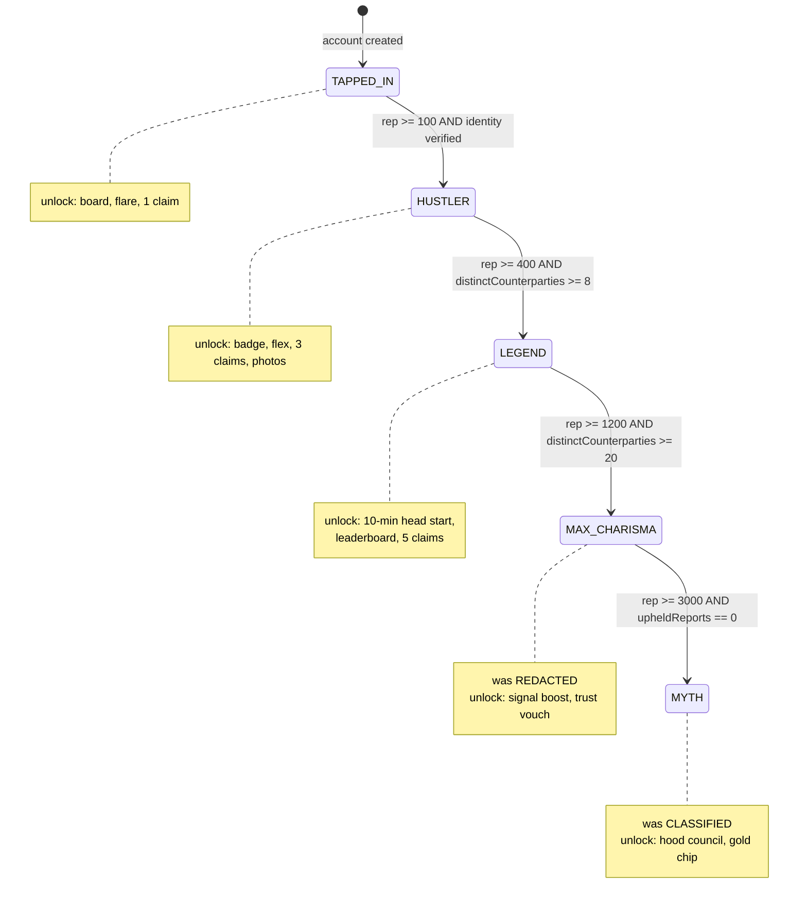
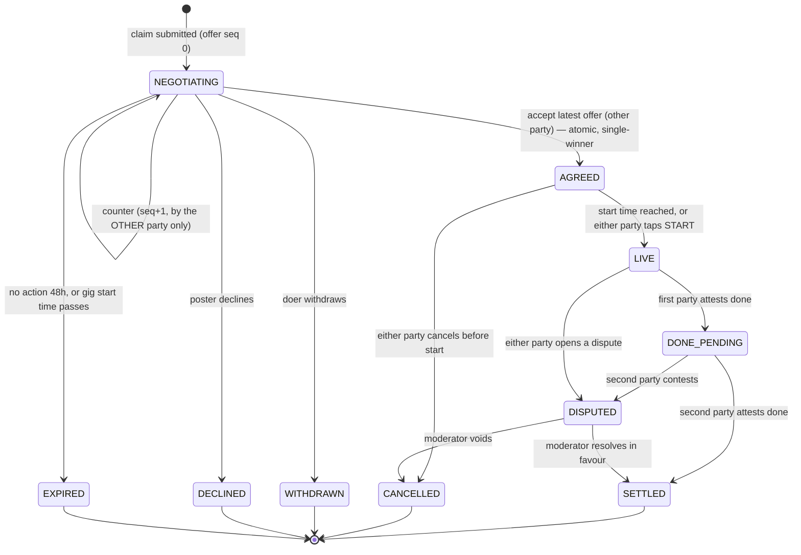
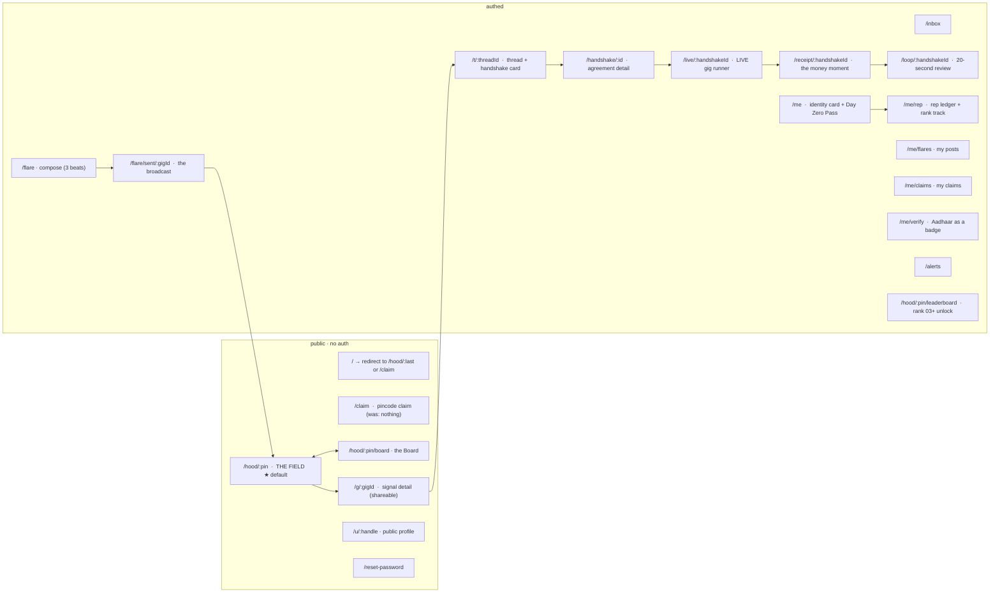
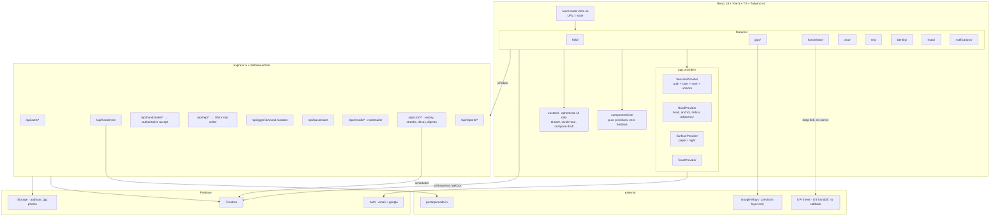

# Design Document: Qwick Gig — Full App Redesign

> Stack constraint honoured throughout: **React 18 + Vite 5 + TypeScript + Tailwind v4 + Firebase 12 + Express 5**. No framework rewrite. Three runtime additions only: `react-router-dom` (the app currently has no router), `zustand` (~1.2 KB, ephemeral UI state), and `fast-check` (dev, property tests) — against which `d3`, `@react-oauth/google` and client-side `@google/genai` are **removed** (§K.8), so the dependency count goes *down*. Everything else is deletion, restructuring, and design.

---

## A. Design Philosophy & The Benchmark Gap

### A.1 The thesis

The landing page sells a **live neighbourhood with a scoreboard**. The current app delivers **a classifieds form with a slate-grey dashboard around it**. That is the entire gap, and it is not a colour problem — it is a *model* problem. The landing page's three promises are all structural:

1. **"your next ₹400 is 312 metres away"** → the product's primary object is *proximity*, not a list. The app's primary object is a `FeedView` filtered by `gigCity.toLowerCase() === currentCity.toLowerCase()`. A string compare against `"Bengaluru"` is the opposite of 312 metres.
2. **"some gigs only unlock at higher rep 👀"** → rep must *gate real things*. In the app, rep does not exist. `rating: 4.8, ratingCount: 5` is hardcoded as a default in three separate places (`App.tsx` initial state, `handlePostGig`, `handleRateUser`) — the app ships fabricated social proof and nothing earned.
3. **"₹0.00 platform fee · middleman: none"** → the money-never-held property is the brand's central claim, and the app never once shows it. There is no payment moment in the UI at all.

So the redesign is stated in one line:

> **Turn the three claims the landing page makes into the three mechanics the app runs on: the Field (proximity is the interface), Rep (progression gates real capability), and the Handshake (two humans agree, money moves between them, we are never in the path).**

Everything else — the ink boxes, the grain, the lowercase voice — is the *surface* that makes those mechanics feel like the same product. Necessary, not sufficient. A reskin of the current workflows would ship a beautiful classifieds form, and Darshan would be right back where he is now.

### A.2 What "exceed the benchmark" means concretely

The landing page is a **demo**: the proximity field has 8 hardcoded `SIGNALS`, the day-timeline hash-generates fake tasks, the ranks 04/05 are `[REDACTED]`. Beating it is not out-designing it — it is **making all of it true**, which the landing page structurally cannot do:

| Landing page / prototype does | The app must do (the exceed) |
|---|---|
| 8 hardcoded signals at fixed `x/y` % | Real gigs projected from real `lat/lng` onto the same field, live via Firestore |
| Cursor spotlight + `Math.hypot` within 88px preview | Same physics, plus touch-native (this is a phone-first audience — the prototype's `pointermove` proximity is desktop-only), keyboard, and screen-reader parity |
| Pincode lookup rewrites `[data-area]` text | Pincode **is** the data partition: `hoodId` — the launch strategy becomes the query key |
| Day-timeline hash-generates 4 tasks per hour | Real aggregation of the hood's actual gigs by hour; the scrubber is a *filter*, not a toy |
| Ranks 04/05 blurred `[REDACTED]` | Reaching rank 04 **reveals and grants** the thing. The blur is a promise with a payment date |
| Day Zero Pass is a shareable image | Day Zero Pass becomes the permanent in-app identity card with a founder marker |
| Receipt shows ₹0.00 as marketing | The completion screen *is* the receipt, generated from the real agreed price |

### A.3 The gap table

| Dimension | Current app (`its_a_copy`) | Benchmark (`real_landing_page`) | Redesign target |
|---|---|---|---|
| **Palette** | `#4F46E5` indigo on `#F8FAFC` slate; `#D1FAE5` mint | paper `#efe7d2`, ink `#0c0b09`, lime `#c8ff3e`, magenta `#ff2e88`, cobalt `#586cff`, cyan `#38e1ff`, peach `#ffb38a` | Benchmark palette, **extended** with `magenta-deep`/`cobalt-deep` for accessible text, plus a full dark "Night Board" surface set derived from the Day Zero Pass darks |
| **Type** | Inter / Space Grotesk / JetBrains Mono | Bricolage Grotesque (opsz 12–96) / DM Sans / Space Mono / Caveat | Same four, but self-hosted, variable, subset, budgeted (§I.4). Caveat lazy-loaded |
| **Surface language** | `rounded-xl` + soft `box-shadow` | `2.5px` ink border + `6px 6px 0` hard shadow, `translate` on press, per-card `--rot` tilt | Ported verbatim as primitives (`InkBox`, `InkPress`, `TiltCard`) and made *systematic*, not per-component ad-hoc |
| **Voice** | "A seamless platform for local gig and freelance work matching." / "Gig Posted! 📣" | "post literally anything. get it done by someone 2 streets away." / "gimme at least 2 letters bestie" / "BY JOINING YOU AGREE TO BE A DECENT HUMAN" | Single `copy/` module. Errors, empty states and loading states are the highest-value voice surfaces and currently have none |
| **Browse model** | `filteredGigs` = city string equality; `distance.ts` exists but is unused for filtering | Proximity field, 2 km radius, distance in metres | **The Field** is the default route. List is a toggle, not the default |
| **Identity** | 8 hardcoded indigo/pink gradient initial avatars in `getUserAvatarUrl()` | Day Zero Pass collectible, rank chips | Zine avatar system (halftone + palette + ink border); Day Zero Pass as the identity card |
| **Progression** | none; `rating: 4.8, ratingCount: 5` hardcoded | 5 named ranks, 2 of them locked | Server-authoritative rep ledger, 5 ranks, real unlocks, anti-gaming |
| **Navigation** | `useState<ActiveView>` + `window.scrollTo(0,0)`; no router; two ad-hoc `?redirect=` params | n/a (single page) | `react-router-dom`, URL as state, deep links, correct back button |
| **Money** | never mentioned in UI | receipt, ₹0.00 fee, calculator | Handshake receipt + UPI deep link + mutual paid-attestation; platform never in the path |
| **Feedback** | `useEffect` force-sets `activeView = FEEDBACK`; `handleNavigate` refuses every destination with "Please submit your feedback to unlock your account access." | n/a | Rewarding loop, 72h grace, double-blind reviews, **rep freeze never navigation lockout** |
| **Security** | deployed `firestore.rules` is `allow read, write: if true` | n/a | Hardened rules; rep and verification server-only; location fuzzing |
| **Structure** | every file at repo root; `App.tsx` imports `./components/Header`; no Vite aliases → **the repo as pushed cannot build** | n/a | Real `src/` tree, feature folders, aliases, all imports corrected |

### A.4 Three defects that are design problems, not chores

**A.4.1 The repo cannot build.** The AI Studio → GitHub export flattened the tree. `App.tsx` line 2 is `import Header from "./components/Header"` while `Header.tsx` sits at repo root, and `vite.config.ts` declares no `resolve.alias`. Same for `./utils/distance`, `./utils/stringUtils`, `./utils/emailNotifications`, and every other view. This is treated as a first-class deliverable (§G.2) because the folder structure *is* the maintainability design, and `App.tsx` at 82,682 bytes with ~15 `onSnapshot` subscriptions is the thing the structure has to solve.

**A.4.2 `index.css` contains generated CSS that will shatter.** Selectors like

```
div#root:nth-of-type(1) > div:nth-of-type(1) > main:nth-of-type(1) > div:nth-of-type(1)
  > div:nth-of-type(2) > section:nth-of-type(4) > div:nth-of-type(2) > ... { ... !important }
```

bind styling to exact DOM sibling positions. Any JSX reorder silently breaks the UI. There are also `!important` overrides pinned to `#user-profile-modal > div:nth-of-type(3)` and `#close-profile-modal-footer` re-declaring indigo. **All of it is deleted.** The redesign's `index.css` is `@import "tailwindcss"` + `@theme` tokens + ~14 named utility classes. Nothing positional, nothing `!important` except the `prefers-reduced-motion` reset.

**A.4.3 Security is currently open.** Deployed rules:

```
match /{document=**} { allow read, write: if true; }
```

`firestore.rules.original` is a 0-byte file. `DRAFT_firestore.rules` is much better but still: `match /gigs/{gigId}/private/contact { allow read, write: if isSignedIn(); }` — which means **any logged-in user can read every poster's phone and email**, defeating the exact privacy model the app took the trouble to build (public docs strip `posterPhone`/`posterEmail` and carry only `posterId = hashEmail(email)`). Also `allow update` and `allow delete` on `gigs/{gigId}` require only `isSignedIn()` with no ownership check — any user can edit or delete any gig. The redesign adds rep and coordinates to the data model, so rules are designed alongside (§G.6), not after.

---

## B. The Ported + Extended Design System

Naming convention used everywhere in this document and intended for the code:

| Product word | Means |
|---|---|
| **the Field** | the proximity map surface (primary browse) |
| **signal** | a gig, as rendered on the Field |
| **flare** | the act of posting (broadcasting a signal) |
| **hood** | a pincode-scoped area — the data partition and the social unit |
| **handshake** | the negotiated agreement artefact between poster and doer |
| **rep** | the progression currency |
| **the Board** | the list view of the hood |

### B.1 Token set — `src/styles/theme.css`

```css
@import "tailwindcss";

@theme {
  /* ---- surfaces: paper (day) ---- */
  --color-paper:        #efe7d2;
  --color-paper-2:      #e6dcc0;
  --color-paper-3:      #f7f2e4;   /* new: raised cards on paper */
  --color-ink:          #0c0b09;
  --color-ink-soft:     #2a2823;
  --color-ink-mute:     #636056;   /* new: from .faq-handwritten colour; body-secondary, 7.1:1 on paper */

  /* ---- accents ---- */
  --color-lime:         #c8ff3e;
  --color-lime-deep:    #9ed400;
  --color-magenta:      #ff2e88;
  --color-magenta-deep: #c4005f;   /* NEW: magenta as TEXT on paper. See I.1 */
  --color-cobalt:       #586cff;
  --color-cobalt-deep:  #3b4ddb;   /* NEW: cobalt as TEXT on paper. See I.1 */
  --color-cyan:         #38e1ff;
  --color-peach:        #ffb38a;

  /* ---- surfaces: night board (dark) ---- */
  /* derived from the Day Zero Pass, which proves the palette works dark */
  --color-night:        #10111b;
  --color-night-2:      #15141b;
  --color-night-3:      #19172b;
  --color-night-line:   rgba(184,133,45,.58);
  --color-gold:         #d69e3b;
  --color-night-text:   #f2efe8;
  --color-night-mute:   #d3cddc;

  /* ---- type ---- */
  --font-display: "Bricolage Grotesque", "DM Sans", system-ui, sans-serif;
  --font-body:    "DM Sans", system-ui, sans-serif;
  --font-mono:    "Space Mono", ui-monospace, monospace;
  --font-hand:    "Caveat", cursive;           /* lazy-loaded, see I.4 */

  /* ---- fluid type scale (display uses clamp + tight tracking + sub-1 leading) ---- */
  --text-hero:    clamp(2.75rem, 11vw, 7.5rem);   /* lh .90  tracking -.03em */
  --text-h1:      clamp(2rem,   7.5vw, 4.5rem);   /* lh .92  tracking -.02em */
  --text-h2:      clamp(1.5rem, 5.5vw, 2.75rem);  /* lh .95  tracking -.02em */
  --text-h3:      clamp(1.25rem, 4vw, 1.75rem);   /* lh 1.0 */
  --text-price:   clamp(1.75rem, 8vw, 3.25rem);   /* display 800, always ₹-prefixed */
  --text-body:    1rem;                            /* lh 1.5 */
  --text-small:   0.8125rem;
  --text-micro:   0.6875rem;  /* 11px mono, uppercase, tracking .14em */
  --text-nano:    0.625rem;   /* 10px mono, uppercase, tracking .16em */

  /* ---- border weights (the ink system) ---- */
  --stroke-sm: 2px;
  --stroke:    2.5px;
  --stroke-lg: 3px;

  /* ---- hard shadow offsets ---- */
  --pop-sm: 4px;
  --pop:    6px;
  --pop-lg: 10px;

  /* ---- radii: the zine is mostly square. curves are reserved ---- */
  --radius-none:  0px;
  --radius-chip:  999px;   /* pills only */
  --radius-pass:  28px;    /* the Day Zero Pass — the ONLY large radius in the system */
  --radius-soft:  8px;     /* .redacted, inputs on night surfaces */

  /* ---- spacing: 4px base, thumb-reach aware ---- */
  --space-1: .25rem; --space-2: .5rem;  --space-3: .75rem; --space-4: 1rem;
  --space-5: 1.5rem; --space-6: 2rem;   --space-8: 3rem;   --space-10: 4rem;
  --tap-min: 44px;          /* every interactive target */
  --thumb-zone: 168px;      /* bottom band reserved for primary actions on mobile */

  /* ---- motion ---- */
  --ease-out-quint: cubic-bezier(.2,.7,.2,1);
  --ease-snap:      cubic-bezier(.16,1,.3,1);
  --dur-press:  80ms;    /* .ink-press */
  --dur-tilt:   250ms;
  --dur-drawer: 380ms;
  --dur-reveal: 700ms;
  --dur-radar:  9s;
  --dur-marquee: 38s;

  /* ---- z-index ladder (single source of truth; the current app has none) ---- */
  --z-field-bg:     0;
  --z-field-rings:  1;
  --z-field-radar:  2;
  --z-field-you:    8;
  --z-field-nodes: 10;
  --z-drawer:      30;
  --z-bottomnav:   40;
  --z-header:      45;
  --z-grain:       60;   /* matches benchmark .grain z-index:60 */
  --z-modal:       70;
  --z-toast:       80;
  --z-skiplink:   100;
}
```

**Note on `--color-ink-mute: #636056`** — lifted from the benchmark's `.faq-handwritten` colour. The current app's `--color-brand-gray: #64748B` is a blue-grey that fights paper; `#636056` is a warm grey that belongs to it.

### B.2 Signature utilities — `src/styles/ink.css`

Ported from the benchmark with the exact numbers, expressed as tokens. These are the whole visual identity; they are *not* re-derived per component.

| Utility | Definition | Notes |
|---|---|---|
| `.ink-box` | `border: 2.5px solid ink; box-shadow: 6px 6px 0 0 ink` | default card |
| `.ink-box-sm` | `2px` / `4px 4px 0` | chips, inputs, dense mobile lists |
| `.ink-box-lg` | `3px` / `10px 10px 0` | hero cards, the Pass |
| `.ink-box-magenta` / `-lime` / `-cobalt` | same border, coloured shadow | state signalling: magenta = urgent/live, lime = agreed/done, cobalt = money |
| `.ink-press` | `transition: transform 80ms, box-shadow 80ms`; hover `translate(2px,2px)` shadow→3px; active `translate(5px,5px)` shadow→1px | **the tactile grammar.** Every button. Never a colour-only hover |
| `.tilt` | `transform: rotate(var(--rot,0deg))`, hover → `rotate(0) translateY(-5px)` | per-card `--rot` seeded deterministically from gig id (§H.8) so a card's tilt never changes between renders |
| `.grain` | fixed `::before`, feTurbulence fractalNoise 0.9/2 octaves, `opacity:.16`, `mix-blend-mode: multiply`, `z-index:60` | conditionally mounted (§I.5) |
| `.halftone` / `.halftone-lime` | `radial-gradient(ink 1.1px, transparent 1.2px) / 10px`; lime variant `1.4px/12px` | also the loading shimmer base |
| `.marquee` / `-rev` / `-fast` | 38s / 46s / 22s infinite, `width: max-content`, pause on hover | status rail, hood ticker |
| `.reveal` / `.in` | `translateY(26px)` → 0, `700ms ease-out-quint` | IntersectionObserver, one-shot |
| `.stroke-ink` / `-thin` | `-webkit-text-stroke: 2px / 1.5px ink; color: transparent` | outlined display text |
| `.scribble` | inline SVG magenta hand-drawn underline, `background-size: 100% .42em` | emphasis in headlines |
| `.tape` | `74×22px`, `#c8ff3eb8`, `1px dashed #0c0b098c`, `backdrop-filter: blur(1px)` | "NEW", "URGENT", pinned things |
| `.redacted` | `blur(5px)`, `opacity .75`, dashed border, `radius 8px`, `user-select:none` | **load-bearing**: locked rank rewards, pre-agreement contact details |
| `.field-input:focus` | `box-shadow: 5px 5px 0 magenta; transform: translate(-1px,-1px); outline: none` | tactile focus; see §I.2 for the `:focus-visible` a11y addition |
| `.receipt` | dashed dividers, dotted leader lines, mono right-aligned ₹ column | the completion artefact |
| `.no-scrollbar` | hide scrollbars | horizontal rails |

Keyframes ported verbatim: `floaty` (5s, ±10px + rotate), `wiggle` (3.4s), `spin-slow` (14s), `blink` (1.1s `step-end` — live indicators), `marquee-left`, `marquee-right`. New: `radar` (9s linear rotate, from the prototype's `.scan-light`), `nodepulse` (2.6s, staggered by `--delay`), `flare-out` (the broadcast animation, §E.2).

All of it inside the benchmark's discipline, extended to cover the new animations:

```css
@media (prefers-reduced-motion: reduce) {
  .marquee, .marquee-rev, .floaty, .wiggle, .spin-slow, .blink,
  .radar, .nodepulse, .flare-out { animation: none !important; }
  .reveal { opacity: 1; transform: none; }
  .ink-press, .tilt { transition-duration: 1ms; }
}
```

### B.3 Dark surface guidance — the Night Board

**Why the app needs it and the landing page didn't:** the prototype's own `DAY_MOODS` data tells the story — `17: 'the board wakes up'`, `18: 'after-class rush'`, `21: 'last-call tasks'`, `23: 'tomorrow starts now'`. Peak liquidity for a hyperlocal student board is 17:00–23:00. Serving `#efe7d2` paper at 22:00 on a phone at full brightness is hostile. And the Day Zero Pass already proves the palette holds on `#10111b`.

Implementation: a `data-surface="paper" | "night"` attribute on `<html>`, with `@theme` semantic aliases remapped — **not** a second set of components.

| Semantic token | paper | night |
|---|---|---|
| `--surface-1` | `--color-paper` | `--color-night` |
| `--surface-2` | `--color-paper-2` | `--color-night-2` |
| `--surface-raised` | `--color-paper-3` | `--color-night-3` |
| `--text-1` | `--color-ink` | `--color-night-text` |
| `--text-2` | `--color-ink-mute` | `--color-night-mute` |
| `--line` | `--color-ink` | `--color-night-line` |
| `--pop-color` | `--color-ink` | `--color-gold` |
| `--accent-text` | `--color-magenta-deep` | `--color-lime` |
| `--field-spotlight` | `rgba(200,255,62,.34)` | `rgba(200,255,62,.20)` |

Night-mode rules:
- Hard shadows become **gold-tinted at 1px border + 6px offset** (the Pass's `1px solid rgba(184,133,45,.58)`), because a 2.5px ink border on a near-black surface is invisible.
- Lime and cyan are the night accents (16.7:1 and 12.5:1 on ink). Magenta drops to accent-fill only.
- Grain opacity drops `.16 → .09` (multiply blend on dark crushes detail).
- Trigger: default `auto` — night from local sunset to 06:00, computed from the hood's lat (no extra permission needed, we already have hood coords), with a manual 3-way override `auto | paper | night` persisted in `localStorage` and in the URL for shareable screenshots (`?surface=night`).

### B.4 Primitive component inventory

`src/components/ink/` — no business logic, no Firebase imports, every one of these is a pure presentational primitive.

```ts
// ---------- surfaces ----------
type Pop = 'sm' | 'md' | 'lg';
type PopColor = 'ink' | 'magenta' | 'lime' | 'cobalt' | 'gold';

interface InkBoxProps extends React.HTMLAttributes<HTMLElement> {
  as?: keyof JSX.IntrinsicElements;   // default 'div'
  pop?: Pop;                          // default 'md'  → --pop
  popColor?: PopColor;                // default 'ink'
  flat?: boolean;                     // border, no shadow (dense lists — see K.2)
  children: React.ReactNode;
}

/** Any pressable. Wraps <button> or <a>; applies .ink-press + 44px min target. */
interface InkPressProps extends InkBoxProps {
  variant?: 'primary' | 'ghost' | 'danger' | 'lime' | 'cobalt';
  size?: 'sm' | 'md' | 'lg';
  loading?: boolean;                  // swaps label for a mono status line
  loadingLabel?: string;              // in-voice, e.g. "sending the flare…"
}

/** Deterministic rotation from a seed so a card never re-tilts between renders. */
interface TiltCardProps extends InkBoxProps {
  seed: string;                       // gig.id | user.uid
  maxRot?: number;                    // default 2.2 (deg)
  disabled?: boolean;                 // dense list mode disables tilt (K.2)
}

// ---------- texture ----------
interface GrainProps    { opacity?: number }              // auto-disabled by useTextureBudget()
interface HalftoneProps { tone?: 'ink' | 'lime'; size?: number; className?: string }
interface TapeLabelProps{ children: React.ReactNode; rot?: number; tone?: 'lime' | 'magenta' }
interface ScribbleUnderlineProps { children: React.ReactNode }
interface StrokeHeadingProps { level: 1|2|3; weight?: 'thin' | 'bold'; children: React.ReactNode }

// ---------- motion ----------
interface MarqueeProps {
  items: React.ReactNode[];
  speed?: 'slow' | 'normal' | 'fast';   // 46s | 38s | 22s
  reverse?: boolean;
  pauseOnHover?: boolean;               // default true
  ariaLabel?: string;                   // the track itself is aria-hidden; label lives here
}
interface RevealProps  { delay?: 0|1|2|3; children: React.ReactNode }
interface CountUpProps { to: number; durationMs?: number; format?: (n: number) => string; prefix?: string }
interface ScrambleTextProps {
  text: string;
  charset?: string;                     // default "█▓▒░#@%&*?/\\<>*"
  trigger?: 'mount' | 'inview' | 'hover';
}

// ---------- data display ----------
interface ReceiptProps {
  head: { left: string; right: string };
  lines: Array<{ label: string; value: string; zero?: boolean }>;
  total: { label: string; value: string };
  footNote?: string;
}
interface RedactedRevealProps {
  locked: boolean;
  placeholderWidth?: number | string;   // blurred bar width when locked
  children: React.ReactNode;            // revealed content
  unlockHint?: string;                  // "hits at rank 04 👀"
}
interface StatusPillProps { status: GigStatus | HandshakeState; size?: 'sm' | 'md' }
interface RankChipProps   { rank: RankId; showLabel?: boolean; locked?: boolean }
interface PriceProps      { amount: number; size?: 'sm' | 'md' | 'lg' | 'hero'; strike?: number }
interface AvatarProps     { user: PublicIdentity; size?: 24|32|48|64|96; showRank?: boolean }

// ---------- the field ----------
interface SignalNodeProps {
  signal: FieldSignal;
  active: boolean;
  onPreview: (id: string) => void;
  onOpen: (id: string) => void;
}
interface ProximityFieldProps {
  signals: FieldSignal[];
  anchor: GeoPoint;                     // the hood centre = the "YOU" marker
  radiusM: number;                      // default 2000
  onPreview?: (s: FieldSignal | null) => void;
  onOpen?: (s: FieldSignal) => void;
  surface: 'paper' | 'night';
}
interface DistanceRingsProps { radiiM: number[]; radiusM: number }  // [250,500,1000,2000]
interface DayScrubberProps {
  hour: number; onHour: (h: number) => void;
  buckets: HourBucket[];                // real data, not hashed
  mood: string;
}

// ---------- feedback / state ----------
interface SkeletonProps { lines?: number; halftone?: boolean; statusLine?: string }
interface EmptyStateProps { art: 'ghost-town' | 'no-signals' | 'all-caught-up' | 'offline';
                            title: string; body: string; action?: React.ReactNode }
interface ToastProps { tone: 'neutral' | 'win' | 'warn'; message: string; undo?: () => void }
```

**Deleted primitives:** the current `getUserAvatarUrl()` 8-gradient indigo/pink/emerald generator. Replaced by a palette-locked variant that picks from `[lime, magenta, cobalt, cyan, peach]` as *flat fills with an ink border and a halftone corner*, initials in Bricolage 800, `--rot` tilt seeded from the uid. Same deterministic-hash idea, on-brand output, and it stops producing the "generic SaaS initials avatar" read.

### B.5 Voice module — `src/copy/`

The current app's voice is its second-biggest personality leak after the palette. `metadata.json` says *"A seamless platform for local gig and freelance work matching."* Toasts say *"Gig posted successfully!"* Nothing in the app sounds like the landing page's *"gimme at least 2 letters bestie"*.

Rule: **no user-facing string is written inline in a component.** All strings live in `src/copy/*.ts` as typed records, so voice is reviewable as a diff and testable.

```ts
// src/copy/errors.ts   — validation errors are jokes, per the benchmark
export const errors = {
  nameTooShort:  'gimme at least 2 letters bestie',
  phoneBadLen:   '10 digits, no country code',
  emailBad:      'that email looks mid',
  priceZero:     '₹0 is not a gig, that is a favour',
  priceWild:     'that is a lot of money. sure?',
  titleEmpty:    'what do you actually need doing',
  pincodeBad:    '6 digits. the one on your courier packages',
  consentUnticked: "tick this to prove you're not a menace 😤",
} as const;

// src/copy/loading.ts  — loading states are personality, not spinners
export const loading = {
  field:     ['scanning your hood…', 'counting the neighbours…', 'triangulating vibes…'],
  posting:   ['sending the flare…', 'waking up the block…'],
  handshake: ['locking it in…'],
} as const;

// src/copy/empty.ts
export const empty = {
  ghostTown: {
    title: 'your hood is quiet rn',
    body:  'nobody has posted here yet. be the menace who goes first — first flare in a hood is worth double rep.',
  },
  allCaughtUp: { title: 'you have seen everything', body: 'genuinely. touch grass, check back at 6.' },
} as const;
```

Voice constitution (enforced in code review, and lint-checkable):
1. Headlines lowercase. Mono micro-labels UPPERCASE with `.14em` tracking. Never the reverse.
2. Second person. "your hood", not "the user's area".
3. ₹ always prefixed, `toLocaleString('en-IN')` always (lakh grouping — `1,00,000` not `100,000`). The prototype already does this correctly in its `rupees()` helper.
4. Emoji: at most one, at the end, never mid-sentence, never in a mono label. The current app's `"Gig Posted! 📣"` / `"Welcome to Qwick Gig! 🎉"` / `"Gig Filled 📌"` / `"Identity Verified successfully ✓"` pattern is emoji-as-decoration; the benchmark uses emoji as punchline (`"unlock at higher rep. 👀"`).
5. Never apologise for the product. No "Oops!", no "Something went wrong."
6. Real hood names in every placeholder: HSR Layout, Indiranagar, Koramangala, Powai, Bandra, Vile Parle W, Hauz Khas, GK-1, Koregaon Park, Aundh, Gachibowli, Whitefield, Salt Lake, Alipore, Sector 17, Electronic City, Vellore.


---

## C. The Map As The Product

The prototype's own source comment states the thesis better than any spec could:

> `/* QWICK GIG / LIVE PROXIMITY FIELD — the map is a product demonstration, not decoration. */`

In the redesign the Field is promoted from hero decoration to `/hood/:pincode` — **the default authenticated route**. Not a tab. The thing you land on.

### C.1 Decision: custom Field vs Google Maps basemap

Both were evaluated seriously. `@vis.gl/react-google-maps@1.8.3` is already a dependency and `vite.config.ts` already wires four Maps API key env vars, so the "free" option is the basemap.

| Criterion | Custom Field (SVG/DOM, no basemap) | Google Maps + custom zine style |
|---|---|---|
| **Visual fidelity to benchmark** | Total. Ink strokes, halftone blocks, paper fill, lime radar — we author every pixel | Poor. Google's vector styler controls hue/lightness/saturation per feature type. You cannot give a road a 2.5px ink stroke with a 6px hard shadow, cannot apply grain under labels, cannot remove their label typography. The result reads as "a styled Google map", which is exactly the generic look we are escaping |
| **Privacy** | No basemap → **no way to reverse a node into a street address**. Fuzzing (§H.3) is sufficient | A recognisable basemap makes a fuzzed pin trivially resolvable: "that's the pin on 14th Main". Fuzzing radius would have to grow so large the product stops being hyperlocal |
| **Cost** | ₹0 | Dynamic Maps billed per load. The Field is the *home screen*, hit on every session and every hood switch. At 50k DAU with 3 loads/session this is the single largest infra line item, for a zero-revenue product |
| **Performance / network** | ~6 KB of inline SVG, no tiles, works on 3G and offline-after-first-load | Tile fetches, ~90 KB+ of Maps JS on the critical path, visibly poor on a budget Android on patchy data — this audience's median device |
| **Interaction physics** | We own it: proximity preview, radar sweep, node stagger, drawer spring, keyboard traversal | Fighting the map's own gesture handling for pan/zoom vs our proximity scan; marker clustering is theirs, not ours |
| **Real geography** | Requires our own projection (§H.1) — ~40 lines | Free |
| **Truthfulness of position** | Positions are *true relative* (bearing + distance correct), absolute street context absent | True absolute |

**Decision: custom Field is the primary browse surface. Google Maps is retained but demoted to a "precision layer" used in exactly two places:**

1. **Address picking while posting a flare** — the poster needs a real map with real search to pin their actual location. Precision matters, it is a one-off interaction, and the cost is bounded by post volume (low) rather than browse volume (high).
2. **Post-handshake location reveal** — once a handshake reaches `agreed`, both parties get the exact point on a real map with directions. Precision matters, and by then the privacy trade has been consented to by both sides.

This is also the *honest* answer to "I loved the map idea": the prototype's field was never trying to be a map. It is a **radar**. Radar is the correct metaphor for "someone 2 streets away" and it is a metaphor Google Maps actively destroys.

### C.2 The geography ↔ field model

The Field is a square viewport representing a disc of radius `radiusM` (default **2000 m**, matching the landing page's "2 KM LOCAL RADIUS") centred on the hood anchor.

- **Anchor** = the hood's centroid (from the pincode lookup), *not* the user's live GPS. This is deliberate: it means the Field works with zero location permissions (the prototype boasts `NO LOCATION PERMISSION NEEDED`), it is stable across sessions, and the "YOU" marker does not broadcast the user's real position to the rendering layer at all. If the user *does* grant precise location, we offer a `PRECISION: ON` toggle that re-anchors to their live point and shows true distances; it is opt-in and never required.
- **Projection**: local equirectangular tangent-plane (ENU). Over a 2 km radius the error of treating the neighbourhood as flat is < 0.1 m — far below the fuzzing radius, so it is free accuracy.
- **Radial warp**: an optional monotone `sqrt` warp spreads the dense near-centre cluster outward without ever reordering nodes by distance. Monotonicity is a stated correctness property (§J.4) because breaking it would make the map *lie* about who is closer.

Full signatures and pseudocode in §H.1.

### C.3 Field anatomy



**Chrome around the Field**, ported from the prototype's `.field-topline` / `.field-footer`:

- Top line: `● LIVE · <HOOD NAME>` (blinking lime dot, `blink 1.1s step-end`) and a ticking `HH:MM:SS` clock. The prototype's clock is a genuinely good trust signal — it proves the surface is live.
- Bottom line: `<NN> SIGNALS IN RANGE` · `₹<total> ON THE BOARD` · mode toggle `FIELD ⇄ BOARD`.
- Corner: `12.9121° N / 77.6446° E` in 7px mono — pure texture, and now *real* (hood centroid, rounded to 4dp which is ~11 m, safe).

### C.4 Interaction model — and the phone-first correction

The prototype's proximity preview is `pointermove` + `Math.hypot` within 88 px. **That is a desktop interaction and this audience is phone-first.** Fingers do not hover. Ported as-is, the single best idea in the prototype would be dead on 90% of sessions. So the model is layered:

| Input | Behaviour |
|---|---|
| **Pointer move (mouse/trackpad)** | Spotlight follows via `--mx`/`--my`; nearest node within `88px` becomes `active`; the top-line stats (`₹price`, `312 METRES`) update live. Exactly the prototype, rAF-throttled |
| **Touch drag (the primary input)** | **Scan gesture**: finger down anywhere on the Field starts a scan — the spotlight tracks the finger and the nearest node previews in a fixed peek bar pinned above the thumb zone (never under the finger). Lift within 200 ms + < 8 px movement = tap-to-open. This makes the proximity mechanic *better* on phone than on desktop, because the peek bar is always readable |
| **Tap a node** | Opens the signal drawer (spring up, `--dur-drawer`) |
| **Keyboard** | Field is `tabIndex=0` with `role="application"` and an `aria-label`. `Tab` enters, then **arrow keys traverse by geography**, not DOM order: `→` = next node clockwise by bearing, `↑` = next node closer to centre, `↓` = further. `Enter` opens, `Esc` closes drawer and returns focus to the node. This is strictly better than the prototype's plain focus order |
| **Screen reader** | See §I.3 — the Field has a parallel semantic list, and every node's `aria-label` narrates spatial data in words |
| **Reduced motion** | Radar and node pulses off; spotlight becomes a static ring that jumps (no transition) to the active node; drawer appears without slide |

### C.5 Density: clustering and node budget

The prototype has 8 nodes. A live hood at peak could have 200+.

- **Node budget: 60 rendered DOM nodes.** Beyond that, cluster.
- **Clustering**: uniform grid buckets in *field space* (not geo space) at `cellPx = 48`. Any cell with ≥ 2 signals renders one **cluster node**: an ink disc showing the count and the summed ₹ (`4 · ₹1.9k`), with a lime halftone fill. Tapping it does not zoom — the Field has no zoom, by design. It opens a **cluster sheet** listing those signals as Board rows. This keeps the mental model "the Field is a radar, the Board is a list" intact.
- **Priority when over budget**: rank by `score = w_recency · recency + w_price · priceNorm + w_prox · (1 − distNorm) + w_urgent · urgent`. Signals that lose the budget are still reachable in cluster sheets and on the Board, never silently dropped. A mono line states it plainly: `SHOWING 60 OF 214 · OPEN BOARD FOR ALL`.
- **Node collision**: after projection, a single-pass repulsion (max 3 iterations, 22 px min separation, clamped to the disc) nudges overlapping labels apart. Bounded so it can never move a node across a distance ring — that would break the projection-monotonicity property (§J.4).

### C.6 Performance budget for the Field

| Budget | Target | Mechanism |
|---|---|---|
| Pointer→paint | ≤ 16.6 ms (60 fps) | Single rAF loop; `getCoalescedEvents()` where available; nearest-node search over a **prebuilt spatial hash**, not all nodes (§H.2) |
| Reads per pointer move | 0 layout reads | Node field-space positions are cached at projection time. The prototype calls `getBoundingClientRect()` **per node, per pointer move** — that is O(n) forced layout on every frame and it is the one thing from the prototype that must not be ported |
| Field mount | ≤ 120 ms on a mid Android | Static SVG background inlined; nodes rendered after first paint |
| Re-project | only on `anchor`, `radiusM`, or viewport resize change | `useMemo` on those three; signal set changes only re-map, never re-derive the transform |
| Signals subscribed | ≤ 1 hood + optional adjacent hoods | Geo/hood-bounded query. Replaces the current `onSnapshot(collection(db,'gigs'))` **whole-collection** listener |

### C.7 Hood selection replaces the city string

Current: `currentCity` is a string in `localStorage`, defaulting to `"Bengaluru"`, and browse is `gigCity.toLowerCase() === currentCity.toLowerCase()`. A gig in Whitefield and a gig in Yelahanka are both "Bengaluru" — 35 km apart, in a product whose promise is 312 metres.

Replaced by the prototype's pincode mechanic, promoted to the data layer:

1. **Claim your hood** — 6-digit pincode, validated `^[1-9][0-9]{5}$` (the prototype's regex, which correctly rejects leading zero).
2. **Resolve** — `https://api.postalpincode.in/pincode/{pin}`, with the prototype's `pickPostOffice()` cleanup (skip names containing parens or `NA`, prefer length > 3) and its `tidy()` regex. Cached in Firestore `hoods/{pincode}` on first resolution so the second user in a hood never hits the third-party API. Static fallback table for `560102 / 400076 / 411001 / 110016 / 600040` retained, plus graceful `"NOT FOUND — YOU CAN STILL TYPE YOUR AREA"`.
3. **`hoodId = pincode`** becomes the partition key on every gig. Browse = `where('hoodId','in', [home, ...adjacent])`. Adjacency comes from `hoods/{pincode}.adjacent` (precomputed from centroid distance ≤ 3 km, capped at 9 to respect Firestore's `in` limit of 10).
4. **`geohash7`** on every gig as a secondary index for true radius queries when a hood is sparse (7 chars ≈ 153 m cell).
5. Hood switching is a **URL change** (`/hood/560102`), so it is shareable, back-button correct, and deep-linkable — three things the current `handleCityChange` + `localStorage` cannot do.

The strategic payoff: *"we're opening pincode by pincode"* stops being a marketing line and becomes the literal shape of the query, the rules, and the launch switch (`hoods/{pincode}.status: 'waitlist' | 'live'`).

### C.8 Field ⇄ Board

The list does not die — plenty of people will prefer it, and it is the accessible fallback. Both are first-class, both are URL state:

| | `/hood/:pincode` (Field, default) | `/hood/:pincode/board` (Board) |
|---|---|---|
| Model | radar, spatial | list, sortable |
| Sort | n/a — space is the sort | recency · price · distance · rep-required |
| Filters | day scrubber + urgency | full filter sheet |
| Best for | discovery, "what's near me right now" | scanning, comparing, deciding |

Mode persists per user, is reflected in the URL, and the toggle sits in the Field footer as `FIELD ⇄ BOARD` — an `.ink-press` segmented control, one tap, no menu.

### C.9 The day-rhythm scrubber, made real

The prototype's timeline is its second-best idea and it is **entirely synthetic** — `dayTasks(hour)` hashes `pincode-hour` into 4 fake tasks from a 16-item `TASK_POOL`. It teaches the *rhythm* of the marketplace, which is genuinely valuable UX: it tells a new user "come back at 6".

In the app it becomes a real aggregation with two modes:

- **PAST (00 → now)**: real gigs from the last 7 days in this hood, bucketed by posting hour → shows `HOUR · N SIGNALS · ₹TOTAL · <mood>`. This is honest historical density.
- **NOW / AHEAD (now → 23)**: filters the *live* board to gigs whose `startTime` falls in that hour. The scrubber becomes a genuine time filter — "show me what I can do between classes at 14:00".

The mood labels are kept verbatim from the prototype (`8: 'before-class errands'`, `12: 'lunch-break window'`, `17: 'the board wakes up'`, `18: 'after-class rush'`, `21: 'last-call tasks'`, `23: 'tomorrow starts now'`) because they are excellent and they are already the brand's voice. Bucketing logic in §H.7.

When a hood has too little history to aggregate honestly (< 20 gigs in 7 days), the scrubber shows the mood label and a mono line `NOT ENOUGH HISTORY YET · CHECK BACK` rather than a fabricated bar chart. **We never draw invented data.** (See §K.4.)


---

## D. The Rep / Rank System, Made Real

The landing page ships five rank cards, two of them `.redacted` with a lock glyph, plus a locked teaser on the board reading *"some gigs only unlock at higher rep. 👀"*. That is a promise with a due date. Here is the payment.

### D.1 First: fix the credibility problem

The current app hardcodes `rating: 4.8, ratingCount: 5` as a fallback in **four** places — `App.tsx` `currentUser` initialiser, the merged-user objects in `handleLogIn`, `handlePostGig` (`posterRating: activeUser?.rating ?? 4.8`), and `handleRateUser` (`prevRating = 4.8, prevCount = 5` when the user doc has no rating). Consequences:

1. Every brand-new user displays **4.8★ from 5 reviews** they never received.
2. `handleRateUser` then computes `(4.8 × 5 + newRating) / 6` — so a real 5★ review moves a fake 4.8 to 4.83. **Real feedback is drowned by fabricated priors, permanently.** A user with one genuine 1★ review shows 4.17★.
3. It also writes `posterGigsCount: newCount` — the *rating* count — into the gig's gig-count field, so "gigs completed" is silently wrong too.

Fix:
- `rating: null, ratingCount: 0` for new users. Migration zeroes existing seeded values (§G.8).
- Display rule: `ratingCount === 0` → render a `NEW SIGNAL` rank chip, never a number. `1 ≤ n < 3` → show `n` reviews, show the raw stars but labelled `EARLY`. `n ≥ 3` → show Bayesian-shrunk display rating (§H.10) so a single 5★ does not read as "perfect".
- Rep, not stars, is the primary trust surface. Stars are a secondary detail on the profile. This is the deliberate design choice: **star averages are gameable and low-information at low n; a rep ledger of verifiable events is not.**

### D.2 Rep is a server-authoritative append-only ledger

Non-negotiable: **the client can never write rep.** The current app's pattern of client-side `setDoc(users/{email}, {gigsDone: currentDone + 1})` is exactly what cannot happen for rep — it is a read-then-write race *and* it is client-writable.

```
repEvents/{eventId}        // append-only, server-written, immutable
users/{uid}.rep            // denormalised integer, server-written
users/{uid}.repVersion     // monotone counter for optimistic-concurrency + audit
users/{uid}.heat           // decaying 90-day activity score (display only)
```

`rep = Σ repEvents[*].delta`. The denormalised `users/{uid}.rep` is a cache; the ledger is the truth. Any dispute is resolvable by replay, and `POST /api/rep/recompute` (admin) rebuilds from the ledger. Every event carries `idempotencyKey` so a retried write cannot double-grant (§J.7).

### D.3 Rep sources and weights

| Event | Delta | Cap / condition |
|---|---|---|
| `GIG_COMPLETED_AS_DOER` | **+40** | requires handshake `settled` and both parties' completion attestation |
| `GIG_COMPLETED_AS_POSTER` | **+18** | posters build rep too — the board dies without supply |
| `RATING_RECEIVED` | `+(rating − 3) × 8` → −16…+16 | only from a counterparty on a `settled` handshake |
| `REVIEW_GIVEN_FAST` | **+15** | review submitted within 24 h of `DONE`. This is what replaces the punitive locker (§E.6) |
| `REVIEW_GIVEN` | **+6** | within the 72 h grace window |
| `RESPONSE_SPEED` | **+0…+10** | `10 × max(0, 1 − medianFirstReplyMins/60)`, recomputed weekly, capped |
| `IDENTITY_VERIFIED` | **+60** | once, on Aadhaar approval |
| `PHONE_VERIFIED` | **+15** | once |
| `HOOD_CLAIMED` | **+10** | once per user, ever — not per hood |
| `FIRST_FLARE_IN_HOOD` | **+50** | once per pincode **per user**, and only while `hoods/{pin}.gigCount < 10`. Cold-start incentive (§K.4) |
| `STREAK_WEEK` | **+25** | ≥ 1 settled gig in each of N consecutive weeks; caps at +25/week |
| `DAY_ZERO_HOLDER` | **+0** | **deliberately zero.** The Pass grants access, not rep — the landing page's own footer says `ACCESS, NOT REP`. Honouring that line is a trust decision |
| `REPORT_UPHELD_AGAINST` | **−150** | moderation outcome |
| `NO_SHOW_CONFIRMED` | **−80** | counterparty attests, moderator confirms |
| `HANDSHAKE_ABANDONED` | **−20** | agreed then silent > 48 h past start time |

Design notes:
- Doer-heavy weighting (+40 vs +18) because doer supply is the scarce side at launch.
- Rating maps to a *signed* delta around 3★ — a 1★ costs you 16 rep. That makes ratings meaningful without letting them dominate (max ±16 vs +40 for the completion itself).
- `heat` (decaying) is separate from `rep` (monotone lifetime, except explicit penalties). **Ranks use `rep`.** This matters: nobody gets demoted for going on holiday. The Field's "who's active in your hood" uses `heat`.

### D.4 Anti-gaming

Two friends can complete 50 fake ₹50 gigs with each other in an afternoon. Every safeguard below exists to make that not work:

| Attack | Safeguard |
|---|---|
| **Collusion ring** (A↔B farming) | **Pairwise diminishing returns**: the *n*-th settled gig between the same two identities is worth `delta × 1/(1 + max(0, n − 2))`. 1st and 2nd full value; 3rd ×⅓; 5th ×⅕. Genuine repeat business (a regular dog-walk) still accrues, farming asymptotes |
| **Sybil / multi-account** | Rank ≥ 02 requires `IDENTITY_VERIFIED` (Aadhaar). Phone uniqueness is already enforced by query in `handleCompleteOnboarding` — moved server-side to a `phoneIndex/{phoneHash}` doc with a rules-enforced create-once, because a client-side `getDocs` uniqueness check is a race |
| **Distinct-counterparty gate** | Rank 03 requires **≥ 8 distinct verified counterparties**; rank 04 requires ≥ 20. Held in `users/{uid}.counterpartySet` (a server-maintained rolling HyperLogLog-style count, or a simple `Map<uidHash, count>` capped at 200 entries). You cannot buy rank from one friend |
| **Micro-gig spam** | Rep-eligible gigs need `price ≥ ₹50` **and** `elapsed(agreed → settled) ≥ 8 min`. A ₹10 gig settled in 20 seconds earns ₹0 rep |
| **Rating inflation** | Reviews are **double-blind** — neither side sees the other's until both submit or 7 days pass. Kills reciprocal-5★ and retaliation. Plus: only one rating per settled handshake, enforced by deterministic review id `${handshakeId}_${reviewerUid}` |
| **Self-dealing** | `poster.uid !== doer.uid` at rules level; and both must not share a `phoneHash` or a device-install id |
| **Rep write forgery** | `repEvents` and `users/{uid}.rep` are **server-write-only** in rules. Client `update` on those fields is denied (§G.6). This is the same class of bug the existing `security_spec.md` already identified for `isVerified` — the spec's "Payload 1: Self-Verification Profile Hijack" reasoning applies verbatim to rep |
| **Velocity abuse** | Rolling caps: `≤ 200 rep/day`, `≤ 700 rep/week` per user. Excess is not lost, it queues (`repEvents.deferredUntil`) — so honest heavy users are delayed, not punished |

### D.5 The five ranks — thresholds and real unlocks

Names taken exactly from the landing page.

| # | Name | Rep | Extra gate | What it actually unlocks |
|---|---|---|---|---|
| **01** | **TAPPED IN** | 0–99 | — | Board + Field access, post a flare, claim a signal, 1 active claim, rep profile |
| **02** | **HUSTLER** | 100–399 | identity verified | Badge on your card, profile flex (highlight reel of 3 gigs), saved scans, **3 active claims**, post with photo |
| **03** | **NEIGHBOURHOOD LEGEND** | 400–1199 | ≥ 8 distinct counterparties | **Head start**: high-value signals (≥ ₹500) are visible to you `HEAD_START_MINS = 10` before the wider board · hood leaderboard placement · **5 active claims** · custom field marker colour |
| **04** | **MAX CHARISMA** | 1200–2999 | ≥ 20 distinct counterparties | *(landing page: `[REDACTED]`)* → **Signal Boost**: pin one of your own flares to the top of the Field for 1 h, once a week · **Trust Vouch**: vouch for a newcomer, transferring 25 of your own rep as stake — returned ×2 if they settle 3 clean gigs, forfeited if they get a report upheld |
| **05** | **MYTH** | 3000+ | ≥ 20 distinct + zero upheld reports | *(landing page: `[CLASSIFIED]`)* → **Hood Council**: vote on the moderation queue and on feature polls · permanent name in the footer watermark rotation · a `MYTH` chip that renders in gold on the Night Board |

**The reveal is the product moment.** Rank cards 04 and 05 render with the benchmark's `.redacted` treatment (blur 5px, dashed border) exactly as on the landing page — *until you cross the threshold*, at which point a full-screen takeover plays: the blur lifts with a `ScrambleText` decode (charset `█▓▒░#@%&*?/\<>*`), the reward names resolve character by character, and the rank chip stamps in with an ink-press thud. That single animation is the entire payoff for the landing page's `👀` and it costs us nothing but sequencing.

### D.6 Making "some gigs only unlock at higher rep 👀" true

Two mechanisms, both enforced server-side:

**1. Head start (default, applies automatically).** A gig with `price ≥ 500` gets `visibleFrom = { r03: createdAt, all: createdAt + 10min }`. Rank 03+ sees it immediately; everyone else 10 minutes later. On the Field, a rank-03 user sees these nodes wearing a lime `EARLY` tape label with a countdown — visible privilege, which is the point of a status system.

**2. Poster-set rep floor (opt-in).** When flaring, the poster can set `minRank`. Below-floor users see the node as `.redacted` — blurred price, blurred title, and the line `unlocks at NEIGHBOURHOOD LEGEND 👀` — which is *literally the landing page's locked teaser card, rendered from real data*. Rationale: a poster handing over house keys should be able to require a track record. Guardrails: `minRank` capped at 03 (04/05 would strand gigs), and a hood-level cap so at most 25% of a hood's open board can be gated — otherwise the board looks locked to newcomers, which kills the funnel.

Enforcement is in **both** places or it is theatre: the Firestore query filters on `visibleFrom`/`minRank` for cheapness, *and* the security rules validate that the requesting user's server-side rank permits the read. Client-side filtering alone would let anyone read the full doc.

### D.7 Progression diagram



Ranks are **never revoked by inactivity** (rep is monotone). They *can* fall if penalties push rep below a threshold — but with hysteresis: you drop a rank only at `threshold − 75`, so a single bad event cannot flip you back and forth. Rank changes always produce a `repEvents` entry and a notification, never a silent change.

### D.8 Data model additions

```ts
export type RankId = 'TAPPED_IN' | 'HUSTLER' | 'LEGEND' | 'MAX_CHARISMA' | 'MYTH';

export interface RepState {
  rep: number;                    // server-only. lifetime, monotone except penalties
  repVersion: number;             // server-only. increments per applied event
  heat: number;                   // server-only. 90-day decayed activity, display use
  rank: RankId;                   // server-only. derived, denormalised for query+rules
  distinctCounterparties: number; // server-only
  upheldReports: number;          // server-only
  streakWeeks: number;            // server-only
  medianFirstReplyMins: number | null;
}

export interface RepEvent {
  id: string;
  uid: string;
  kind: RepEventKind;
  delta: number;                  // post-multiplier, as applied
  rawDelta: number;               // pre-multiplier, for audit
  multiplier: number;             // pairwise diminishing factor
  reason: string;                 // human-readable, shown in the rep ledger UI
  handshakeId?: string;
  counterpartyUid?: string;
  hoodId?: string;
  idempotencyKey: string;         // unique index → no double-grant
  createdAt: number;
  deferredUntil?: number;         // velocity-cap queueing
}

export interface Unlocks {
  maxActiveClaims: number;
  headStartMins: number;          // 0 or 10
  canBoost: boolean;
  canVouch: boolean;
  canCouncil: boolean;
  canAttachPhoto: boolean;
  customMarkerColor: boolean;
}
```

The rep ledger is **user-visible**: `/me/rep` renders every event as a receipt line (`+40 · settled: assemble my ikea desk · 12 nov`), because a progression system you cannot audit feels arbitrary, and arbitrary is the opposite of trustworthy. This is also, conveniently, the most on-brand possible use of the benchmark's `.receipt` component.


---

## E. The Redesigned Workflows

Each flow states **the current failure** (cited from code) and **the fix**. These are workflow changes, not screen reskins.

### E.1 First run: claim your hood, carry your Pass

**Current failure.** Three sequential walls before the user sees a single gig: `AuthModal` → `OnboardingView` (phone + bio + **Aadhaar document upload**) → gated navigation. `handleNavigate` enforces it: `if (!currentUser.onboardingCompleted && view !== ONBOARDING && ...) { setActiveView(ONBOARDING); showToast("Please complete your onboarding to continue."); }`. A Gen-Z user who arrived from a zine-styled landing page is asked for a government ID before seeing any value. Also `handleLogIn` contains three separate `hostname.includes("localhost") || hostname.includes("run.app") || hostname.includes("ai.studio")` branches that **skip Firebase Auth entirely and accept the login if a Firestore user doc exists** — an auth bypass keyed on a string in `window.location.hostname`.

**Fix — value first, identity when it is needed, and make each step feel like a win.**

```mermaid
sequenceDiagram
  autonumber
  participant U as user
  participant A as app
  participant F as firestore
  participant S as express/admin

  U->>A: lands (no account)
  A->>U: PINCODE PROMPT — put your hood on. the prototype pin-command, same energy
  U->>A: 560102
  A->>S: GET /api/hoods/560102  (cached; else postalpincode.in)
  S-->>A: HSR Layout, Bengaluru, KA, centroid, status
  A->>U: FIELD renders — real signals, browsable, ZERO account
  Note over U,A: browse, scan, open drawers. read-only. no wall.
  U->>A: taps CLAIM on a signal
  A->>U: auth sheet — "you need a name on the board" (single step: phone or google)
  U->>A: authenticates
  A->>F: users/{uid} created  · HOOD_CLAIMED +10 · rank TAPPED_IN
  A->>U: DAY ZERO CARD minted — the identity card, immediately
  U->>A: proceeds to claim (intent preserved)
  Note over U,S: Aadhaar is asked LATER, at the rank-02 gate, framed as a badge
```

Three specific design moves:

1. **Browse before auth.** The Field is public read for `hoods/{pin}.status == 'live'`. Claiming, flaring and chatting require auth. The current app already has the right machinery for this — the `intendedAction` pattern (`{type:'express_interest'|'negotiate'|'publish_gig'|...}`) with `triggerAuthGate` and `executeRestoreAction` is genuinely good and is **kept and extended**, because intent-preservation across an auth wall is the hardest part and it already works.

2. **The hood claim is planting a flag, not filling a field.** On successful pincode resolve: the Field animates from a blank paper grid to the hood's street abstraction, the `[data-area]` name types in with `ScrambleText`, the YOU marker drops with a `youpulse` ring expansion, and a toast lands in-voice — `HSR LAYOUT is yours now`. This is exactly the prototype's `applyLocation()` payoff (`toast(\`${location.area} is now on the field\`)`), given weight.

3. **Aadhaar becomes a badge, not paperwork.** Moved out of first-run entirely, to the **rank 02 gate**, where the framing inverts: instead of *"upload your ID to continue"* it is *"you're 40 rep from HUSTLER. one thing left: prove you're real. +60 rep, verified chip, and posters can require it."* Same document, same admin approval path (`verificationStatus: 'pending' → approved`, which the app already implements including the live `onSnapshot` that fires the "Identity Verified successfully ✓" toast). What changes is that it is now a **reward with a stated price**, and the pending state gets its own honest UI (`.redacted` verified chip + `UNDER REVIEW · USUALLY < 24H`) instead of silence.

**Day Zero Pass carry-forward.** The landing page's Pass is the emotional bridge from waitlist to app; dropping it on install would be a broken promise. Design:
- Waitlist entries (name/pincode/email/phone, position number) are written to `waitlist/{emailHash}` by the landing page.
- On first app auth, `POST /api/pass/claim` matches on verified email **or** verified phone. On match: `users/{uid}.dayZero = { position, issuedAt, hoodAtIssue }`.
- The in-app **identity card** is the Pass: the same `--radius-pass: 28px` dark collectible with the gold hairline border, the dotted texture, the 28-bar signal equaliser, dashed dividers, and the mono micro-labels `ISSUED TO / HOOD / MEMBER SINCE / STATUS: CLAIMED ✓`. It now additionally carries the live rank chip, rep, and gigs settled — the card *grows with you*.
- Day Zero holders get a permanent `#0184` founder marker and their footer line reads `ACCESS, NOT REP` — kept verbatim, and now literally true because §D.3 grants the Pass **zero** rep.
- Non-holders get the same card without the founder marker. No fake scarcity, no FOMO nag.

**Auth security fixes (all three hostname bypasses deleted):** local development uses the Firebase Auth emulator (`VITE_USE_AUTH_EMULATOR=1`), never a hostname check. `POST /api/auth/register` stays (server-side atomic create + welcome email is the right shape). The legacy-password migration path (`/api/auth/migrate-legacy-user`) stays but its failure mode becomes "invalid credentials", full stop — no Firestore-doc-existence fallback.

### E.2 Flaring a gig: broadcast, don't submit

**Current failure.** `PostGigView.tsx` is 65,710 bytes of form. Fields: title, description, price, date, startTime, photo, address, locationName, suburb, lat, lng, category, phone. The reward for completing it is `PublishedView` and a toast reading `"Gig posted successfully!"` with a notification titled `"Gig Posted! 📣"`. The user has no idea whether anyone will see it. The draft is persisted to `localStorage["qwick_draft_gig"]` and auto-published post-auth (good), but the whole act *feels* like filing a form because it is one.

**Fix — reframe posting as firing a flare, with the reach made visible.**

| Old | New |
|---|---|
| 13-field single-column form | **3 beats**: *what* → *what's it worth* → *where & when*. One thumb-reachable question per beat |
| No feedback until submit | **Live signal card preview** pinned above the keyboard, tilting into place, updating as you type. You are composing the artefact the hood will see, not filling inputs |
| Blank price field | **Price guidance** from the hood's real history: `similar gigs in HSR went for ₹250–₹450` with a `₹350 · MEDIAN` tap-to-fill chip. Derived from `hoods/{pin}.priceStats` bucketed by duration band. Solves the #1 new-poster paralysis and improves fill rate |
| `category` dropdown | **Freeform, zero categories** — the landing page's receipt literally reads `categories: 0` and the prototype's principle card says *"No service menu. No category."* The current `category: gig.category \|\| "Other"` contradicts the brand. Replaced by optional freeform tag pills rendered in palette colours, and a server-side classifier used **only** for internal analytics and safety screening, never shown as a taxonomy |
| Confirmation screen | **The broadcast.** On publish: the compose sheet collapses into a signal node, the node lands on the Field at its projected position, and three lime `flare-out` rings radiate outward across the distance rings while a mono counter counts up — `REACHING 47 NEIGHBOURS IN HSR LAYOUT`. That number is real: `hoods/{pin}.activeMembers30d`. It answers "did anything happen?" in one second, which is the single biggest anxiety in a marketplace with no audience feedback |
| — | **Smart defaults**: hood prefilled from the claimed hood; date defaults to today with `TODAY / TOMORROW / THIS WEEK` chips; time defaults to the *next* mood window from the day-rhythm data (`the board wakes up` at 17:00) |
| — | **Urgency as a real state**: `urgent: true` (already in the `Gig` type but barely used) gives the node a magenta pulse and a `NOW` tape label, and costs the poster nothing but a 6-hour expiry — urgency you can't fake indefinitely |

### E.3 Discovering and claiming: kill the canned message

**Current failure — the worst copy in the app.** `executeRestoreAction` auto-generates the opening chat message:

```
`Hi ${gigData.posterName}, I am interested in your gig: "${gigData.title}" posted on Qwick,
 and I would like to negotiate the price to ₹${priceToUse}. Is this okay with you?`
```

That is a template a bot writes. In a product whose entire differentiator is *"talk before either side commits"* and whose brand voice is *"CAN DO 7:15. ₹750?"*, sending an identical form letter on every user's behalf destroys the thing being sold. Worse, it fires *before* the human has said anything, so the poster's inbox is full of indistinguishable robot paragraphs and cannot tell candidates apart.

**Fix — the claim ritual.** Tapping `CLAIM` on a signal opens a single sheet with exactly three things:

1. **Your take** — one line, 140 chars, placeholder in-voice: `"i've assembled 4 ikeas, i own an allen key set"`. **Required, min 10 chars.** Friction here is a feature: it filters drive-by claims and gives the poster something to choose between.
2. **Your number** — pre-filled with the asking price, with `ASKING ₹450` / `−` / `+` steppers in ₹25 increments. Changing it turns the claim into a counter-offer automatically (no separate "negotiate" mode — the current app's `express_interest` vs `negotiate` split is an artificial distinction that produced two nearly identical canned messages).
3. **Can you make the time?** — `YES, THAT WORKS` / `I'D NEED <time>`.

Submitting creates a **Handshake** (§E.4), not a chat message. The chat thread is created *with the handshake card as its first item* — a structured artefact — and the user's own one-liner as the first human message. The poster's view of candidates becomes scannable: rank chip · rep · their line · their number · distance. Three claims are comparable at a glance, which is impossible today.

Poster-side additions: `CLAIMS (3)` count on the signal node itself (social proof that the board is alive), and a `SHORTLIST` action so a poster can chat with two people before agreeing.

### E.4 Negotiation and agreement: the Handshake

**Current failure.** `ChatProposal` exists — `{gigId, price, date, startTime, endTime, status: 'pending'|'confirmed'|'rejected'}` — embedded as an optional field on a `ChatMessage`. Problems: it is a message, so it scrolls away; there is no counter-offer (only accept/reject); nothing prevents two proposals being `confirmed`; and separately `handleSelectWorker` mutates the gig to `In Progress` **without reference to any proposal at all**, setting `price: finalPrice` from a different UI. Two competing sources of truth for "what did we agree".

**Fix — promote the agreement to a first-class document with a legal state machine.**

```
handshakes/{handshakeId}          // handshakeId = `${gigId}_${doerUid}`  → one per pair, idempotent
  offers: Offer[]                 // append-only. seq increases. only the last is live
  state: HandshakeState
  agreed?: { price, date, startTime, endTime, agreedAt, agreedOfferSeq }
```



Legality rules (transition table and reducer in §H.6):
- **Only the party who did not author the latest offer may `accept` or `counter` it.** No self-accept.
- Accepting a stale offer (`seq !== latestSeq`) is rejected — kills the "we both countered at once, whose price won?" race.
- **At most one `AGREED` handshake per gig**, enforced by a Firestore transaction on `gigs/{id}.agreedHandshakeId` (compare-and-set from `null`). Every other live handshake on that gig transitions to `DECLINED` in the same transaction. This is the correctness heart of the product and it is a stated property (§J.2).
- `SETTLED` requires **both** attestations. The current app lets the poster alone mark `Completed` and unilaterally increment the worker's `gigsDone`. Two-sided attestation is what makes rep non-forgeable.

**The Handshake card** is the UI: an `.ink-box-cobalt` receipt pinned to the **top** of the thread (not scrolling away), showing the current offer, who moved last, the delta from the asking price (`₹450 → ₹520 · +₹70`), and exactly two big `.ink-press` buttons. Superseded offers collapse into a mono history strip — `₹450 → ₹550 → ₹500 → ₹520 ✓` — which is a genuinely satisfying artefact of a negotiation and makes the whole exchange legible at a glance.

### E.5 Doing it, and the money moment

**Current failure.** Nothing exists here. `handleCompleteGig` flips `status: 'Completed'` and increments a counter. The ₹0-commission claim — the brand's central promise — appears nowhere in the app. There is no proof-of-done, no arrival coordination, no payment moment.

**Fix — three states with real UI.**

**LIVE.** A magenta-shadowed strip pins to the top of every screen: `LIVE · assemble my ikea desk · ₹520 · <countdown>`. Contents:
- **Exact location revealed** (now, and not before — §E.7): full address, the real Google map, `OPEN IN MAPS`.
- **Contact revealed**: phone for both parties, from `gigs/{id}/private/contact`. This is what the private subcollection was built for; it now has a defined reveal trigger instead of being readable by any signed-in user.
- **`ON MY WAY`** — one tap, sends a system message with an ETA. Removes the most common "where are you" chat churn.
- **Safety strip** — `MEETING SOMEONE NEW? MEET IN PUBLIC FIRST` with a report button always one tap away.

**PROOF OF DONE.** Optional photo (`CameraCaptureModal` already exists and is reused), plus a mandatory mutual attestation. Deliberately optional-photo: forcing a photo on "proofread my breakup text" is absurd, and the brand's whole point is that tasks don't fit a template.

**THE RECEIPT — the money moment.** This is the screen that makes the brand's claim visible, and it is a direct port of the landing page's receipt component:

```
QWICK GIG / PAYMENT ROUTE                              #000184
- - - - - - - - - - - - - - - - - - - - - - - - - - - - - - -
TASK                                assemble my ikea desk
                                    pls i'm crying
- - - - - - - - - - - - - - - - - - - - - - - - - - - - - - -
POSTER PAYS  .....................................  ₹520.00
DOER RECEIVES  ...................................  ₹520.00
QWICK GIG RECEIVES  ..............................    ₹0.00   ← cobalt
- - - - - - - - - - - - - - - - - - - - - - - - - - - - - - -
MONEY THAT STAYS LOCAL                                  100%
PAYMENT: DIRECT UPI / CASH · NO WALLET · NO WITHDRAWAL DELAY
```

Mechanics:
- **`PAY ₹520 VIA UPI`** builds a `upi://pay?pa=<doerVpa>&pn=<doerName>&am=520&cu=INR&tn=<gigTitle>` intent and hands it to the OS. The doer's VPA lives in `users/{uid}/private/payment`, revealed only to the counterparty of an `AGREED` handshake. **We never generate a merchant order id, never hold a balance, never take a callback.** The platform is not in the payment path — that is a design invariant, tested as a property (§J.8).
- Or **`PAID IN CASH`**.
- Both parties tap `MONEY SORTED` — a mutual attestation, a *record*, not a transaction. Mismatched attestations open a dispute rather than resolving silently.
- The receipt is shareable (`navigator.share`, clipboard fallback — the same pattern the landing page already uses for the Pass). Every shared receipt is an ad for the ₹0 claim.

**Safety consequence, stated honestly:** no escrow means no platform recourse. So trust load shifts entirely onto identity + rep + reviews + moderation (§E.7, §K.3). The design does not pretend otherwise, and the FAQ says so in the brand's own voice.

### E.6 Closing the loop: delete the hostage locker

**Current failure — the single most harmful thing in the app.** A `useEffect` scans for any `Completed` gig the user participated in without a review and force-sets the view:

```ts
if (unreviewed) {
  setPendingFeedbackGig(unreviewed);
  setActiveView(prev => prev !== ActiveView.FEEDBACK ? ActiveView.FEEDBACK : prev);
}
```

and `handleNavigate` then refuses every destination:

```ts
if (pendingFeedbackGig) {
  showToast("Please submit your feedback to unlock your account access.");
  setActiveView(ActiveView.FEEDBACK); window.scrollTo(0, 0); return;
}
```

Why this is harmful, precisely:
1. **It holds the account hostage.** The user cannot reach their inbox — including an *in-progress* gig's chat — until they rate something. A doer standing outside a stranger's flat, unable to open the thread to say "I'm here", because they haven't rated last week's gig.
2. **It manufactures garbage data.** Coerced ratings are noise, and noise poisons the trust system the coercion was meant to protect.
3. **It is triggered by client state derived from a whole-collection listener**, so a stale local `gigs` cache can lock a user out of a working app. There is already a `localStorage["qwick_submitted_feedback_ids"]` workaround plus a `markFeedbackSubmitted` function that pre-emptively marks *every* completed gig as reviewed — a hack that exists solely to escape the lock, and which silently suppresses genuine review prompts.
4. **It is tonally the opposite of the brand.** "unlock your account access" is debt-collector language in a product that says "bestie".

**Fix — reward the loop, never block the app.**

| Time since `SETTLED` | Behaviour |
|---|---|
| 0–24 h | **Prime window.** A lime `.ink-box-lime` card at the top of the feed: `rate <name> · +15 rep · 20 seconds`. `REVIEW_GIVEN_FAST` = **+15** |
| 24–72 h | Card persists, dismissible, reward drops to `REVIEW_GIVEN` = **+6** |
| 72 h – 7 d | One notification, in-voice: `"<name> is still waiting on your word"`. Card moves to the profile |
| > 7 d, 3+ unreviewed | **Rep freeze**: new rep stops accruing until you close a loop. A mono banner states it plainly: `REP FROZEN · 3 LOOPS OPEN · CLOSE ONE TO THAW`. **Navigation is never restricted. Chat is never restricted. The app always works.** |

Plus:
- **Double-blind release** (§D.4) — mutual reveal or 7-day auto-reveal. Removes retaliation fear, which is the actual reason people skip reviews.
- **20-second review**: three taps — a rating, one optional emoji-tag from a fixed set (`ON TIME` · `SOUND HUMAN` · `WENT ABOVE` · `NO SHOW` · `SKETCHY`), and an optional line. The current `FeedbackView` demands stars + a comment.
- **Streaks**: `STREAK · 4 LOOPS CLOSED` chip on the identity card. Gamify the good behaviour instead of punishing its absence.

### E.7 Trust and safety

**Current state.** `isVerified` badge (Aadhaar, admin-approved) exists and is correctly protected in `DRAFT_firestore.rules` (`request.resource.data.get('isVerified', false) == false` on client writes). Public gig docs strip `posterPhone`/`posterEmail` and carry only `posterId = hashEmail(email)`. That is a good foundation. But: exact `lat`/`lng` are stored **on the public gig doc**, there is no report/block anywhere in the codebase, and the deployed rules are `allow read, write: if true`.

**Fix — five layers.**

1. **Location privacy — the biggest hole.** Public gig docs today carry the poster's exact coordinates, which for a "help me move a sofa" gig is a home address, broadcast to the internet. Redesign: public doc stores only `geo.fuzzed` (deterministic jitter, radius drawn from the annulus **[120 m, 250 m]**), `geohash7`, `hoodId`, and a human `areaLabel` ("HSR Layout, Sector 2"). Exact coordinates live in `gigs/{id}/private/location`, readable **only** by the poster and by the doer of an `AGREED` handshake. Crucially the jitter is **seeded once and never re-rolled** (§H.3) — re-randomising per read would let an observer average many samples and recover the true point. The Field's no-basemap decision (§C.1) is the second layer of the same defence.
2. **Contact privacy fix.** `DRAFT_firestore.rules` currently allows `match /gigs/{gigId}/private/contact { allow read, write: if isSignedIn(); }` — any logged-in user reads any poster's phone. Tightened to poster + agreed doer only, with the reveal moment moved into the UI as a designed event (§E.5).
3. **Public-meetup nudge**, delivered on the promise the landing-page FAQ already makes (*"First meetup? Meet in public. We'll nudge you."*): on the first `AGREED` handshake between two identities, an interstitial suggests three public meeting points near the fuzzed location and offers a one-tap `SHARE MY PLAN` (a WhatsApp/SMS text with gig, name, time, place). Once per pair, never nagged again.
4. **Report / block / dispute** — absent today, added everywhere: on a signal, a profile, a message, and a handshake. Reports write to `reports/{id}` (server-read-only) and enter a moderation queue. Blocking is bidirectional and filters the Field, the Board and search. Rank 05 users vote in the queue (§D.5) — moderation capacity scales with the community, which is the only affordable answer for a zero-revenue product (§K.5).
5. **No-anonymity posture, stated in the brand's voice.** Aadhaar-verified identity is required to *claim* (do work) — the highest-risk action — and posting above ₹1000. The FAQ line: *"you can browse as a ghost. you can't work as one."* And the consent copy the landing page already wrote — `BY JOINING YOU AGREE TO BE A DECENT HUMAN` — becomes the actual community-guidelines heading.

### E.8 Notifications

**Current state.** Firestore `notifications` collection (types `welcome | gig_posted | gig_accepted | urgent`) + SMTP via `sendNotificationEmail` for `gig_interest`, `negotiation_proposed`, `proposal_accepted`. Titles: `"New Interest! 🔔"`, `"Selected for Gig! 🎉"`, `"Gig Filled 📌"`. Every event fires immediately with no batching, and the "Gig Filled" broadcast fans out to every losing candidate individually.

**Fix.**

| Event | Channel | Copy |
|---|---|---|
| new claim on your flare | in-app, **batched 5 min** | `3 people want your ikea desk gig` |
| counter-offer | in-app + push | `ananya countered: ₹520` |
| handshake agreed | in-app + push + email | `locked in. ₹520, today 6pm.` |
| head-start window (rank 03+) | in-app only | `₹800 gig just dropped. you see it 10 min early 👀` |
| rank up | in-app takeover | `MAX CHARISMA. the redacted part is now yours.` |
| loop to close | in-app card, then 1 notification at 72 h | `naveen is still waiting on your word` |
| hood goes live | email + push | `HSR LAYOUT is live. 47 neighbours are already in.` |

Cadence rules: **max 1 push per 15 min per user**, hard-collapsed by category; nothing between 23:00 and 07:00 except an active-handshake message; email reserved for the three things that survive a closed app (agreement, hood launch, verification outcome). Every notification is deep-linked to a real route (`/handshake/:id`), which the current app cannot do since it has no router — its two ad-hoc `?redirect=/chat/:id` / `?redirect=/gig/:id` params are a symptom of that missing layer.

Idempotency: notification ids are deterministic (`${kind}_${subjectId}_${uid}`) so a retried write cannot double-notify (§J.7). Today they are `n-${Math.random().toString(36).substring(7)}` — a 5-char random suffix, which both duplicates on retry and collides.

### E.9 States: empty, loading, error, offline

The current app has `isGigsLoading` / `isReviewsLoading` booleans and essentially no designed states. This is the cheapest personality in the entire product and it is 100% unused.

| State | Design |
|---|---|
| **Loading (Field)** | Paper grid draws in; 6 halftone-shimmer placeholder nodes pulse at low opacity; a mono status line cycles `scanning your hood… / counting the neighbours… / triangulating vibes…`. Skeletons are `.ink-box-sm` with `.halftone` fill and a masked sweep — never a grey rounded rectangle |
| **Empty hood (ghost town)** | **The cold-start case, and the most important empty state in the product.** Shows the hood's real **waitlist density from the landing page** as *ghost signals* — hollow dashed nodes labelled `WAITING`, not gigs. Honest (never fabricated supply), and the Field still looks alive. Plus a hood progress meter (`31 / 40 NEIGHBOURS · OPENS AT 40`), a `BE FIRST` CTA carrying the `FIRST_FLARE_IN_HOOD +50` bonus, and a `LOOK AT NEARBY HOODS` escape hatch. Copy: `your hood is quiet rn` |
| **No results after filter** | `nothing at 14:00. the board wakes up around 6.` + a jump-to-17:00 button, driven by the hood's real hourly histogram |
| **Error** | In-voice, actionable, never apologetic: `firestore ghosted us. retry?` with a retry button and a mono error code for support |
| **Offline** | Detected via `navigator.onLine` + write failures. Ink banner: `you're offline. showing your last scan.` Last Field snapshot cached in IndexedDB and rendered read-only with a `STALE · 12 MIN AGO` tape label. Composing a flare offline is allowed and queued — the app already has draft persistence (`qwick_draft_gig`), so this is a small extension of an existing pattern |
| **All caught up** | `you have seen everything` / `genuinely. touch grass, check back at 6.` |


---

## F. Information Architecture & Screen Inventory

### F.1 The navigation defect being fixed

Today: `const [activeView, setActiveView] = useState<ActiveView>(...)` plus a 12-member enum, and `handleNavigate` does `setActiveView(view); window.scrollTo(0, 0);`. Consequences — no URL for any screen, browser back exits the app, no deep links (except the two `?redirect=` hacks), no shareable gig links, chat threads live in `activeChatThread` state so a conversation cannot be linked, and analytics has no page dimension. Modals (`AuthModal`, `UserProfileModal`, `ChatThreadView`, `CameraCaptureModal`) are booleans, so back never closes them.

Replaced by `react-router-dom` v6 with URL as the single source of truth for: route, hood, field/board mode, day-scrubber hour, filters, surface (paper/night), and open modal (via `location.state.background`).

### F.2 Route map



Modal routes (rendered over a background location so back closes them): `/auth`, `/u/:handle` from a list, `/capture`, `/report/:targetType/:id`, `/rank-up/:rankId`.

### F.3 Screen inventory: kept / merged / split / killed / new

| Old (`ActiveView`) | Fate | New |
|---|---|---|
| `LANDING` | **KILLED in-app** | The landing page is a separate deployed artefact. `/` resolves to the Field or `/claim`. Shipping a second, worse landing page inside the app was always redundant |
| `HOME` + `FEED` | **MERGED** | Two views that both listed `filteredGigs` with different chrome. Now one surface, two modes: `/hood/:pin` (Field) ⇄ `/hood/:pin/board` |
| `POST` | **SPLIT & REBUILT** | `/flare` (3 beats) + `/flare/sent/:gigId` (the broadcast) |
| `PUBLISHED` | **REPLACED** | `/flare/sent/:gigId` — a real reach animation instead of a static confirmation |
| `DETAILS` | **KEPT, rebuilt** | `/g/:gigId`. Now shareable, now the poster's candidate-comparison surface |
| `PROFILE` | **SPLIT** | `ProfileView.tsx` is **127,019 bytes** — the biggest file in the repo, containing own-profile, editing, my-gigs, reviews, login, logout, and password reset. Split into `/me`, `/me/rep`, `/me/flares`, `/me/claims`, `/me/verify`, and `/u/:handle` |
| `NOTIFICATIONS` | **KEPT** | `/alerts`, batched, deep-linked |
| `ONBOARDING` | **DISSOLVED** | Hood claim moves to `/claim` (pre-auth); Aadhaar moves to `/me/verify` behind the rank-02 gate; bio moves to `/me` |
| `MESSAGES` (`InboxView`) | **KEPT** | `/inbox` |
| `ChatThreadView` (state, not a view) | **PROMOTED** | `/t/:threadId` — a linkable route. The file is 63,677 bytes and splits into thread shell + message list + composer + handshake card |
| `FEEDBACK` | **REPLACED** | `/loop/:handshakeId` — opt-in, rewarded, never a lock |
| `RESET_PASSWORD` | **KEPT** | `/reset-password` |
| — | **NEW** | `/claim`, `/handshake/:id`, `/live/:handshakeId`, `/receipt/:handshakeId`, `/me/rep`, `/hood/:pin/leaderboard`, `/report/*`, `/rank-up/:rankId` |

### F.4 Chrome

**Mobile (primary).** Bottom tab bar, 5 slots, thumb-zone anchored with `env(safe-area-inset-bottom)`:

`FIELD` · `INBOX` · **`FLARE`** (centre, lime, `.ink-press`, oversized) · `ALERTS` · `ME`

The `FLARE` action gets the centre slot because posting is the scarce behaviour at launch. The current `BottomNav` gives equal weight to everything.

Top bar is minimal: hood switcher (`HSR LAYOUT ▾`), the live clock, and the surface toggle. Search moves into the Board, not the global header — the current `Header.tsx` is 22,120 bytes carrying search + city switcher + a notification dropdown, and a global search box on a 2 km radar is the wrong affordance.

**Desktop (adaptation, per §I.6).** Two-pane: persistent Field left, drawer/thread/detail right. The Field becomes a genuinely better desktop experience because pointer-hover proximity works — but it is designed second, not first.

---

## G. Technical Architecture

### G.1 System diagram



**Note the shape of the UPI edge**: a dotted, outbound-only, client-side deep link. There is no server component and no callback. That is the architecture diagram of "we never touch the money", and it is a property test (§J.8).

### G.2 Directory layout (fixes the unbuildable repo)

```
qwick-gig/
├─ index.html
├─ vite.config.ts              # + resolve.alias '@' → /src
├─ tsconfig.json               # + paths { "@/*": ["src/*"] }
├─ firestore.rules             # the real hardened rules (replaces the open one)
├─ firestore.indexes.json      # NEW — composite indexes, see G.5
├─ server/
│  ├─ index.ts                 # was: root server.ts (106,421 bytes) — split below
│  ├─ routes/{auth,hoods,handshake,rep,gigs,pass,emails,reports,cron}.ts
│  ├─ services/{repEngine,handshakeEngine,geo,mailer,moderation}.ts
│  └─ middleware/{requireAuth,rateLimit,validate}.ts
└─ src/
   ├─ main.tsx
   ├─ App.tsx                  # ~120 lines: providers + <RouterProvider>. was 82,682 bytes
   ├─ routes.tsx
   ├─ styles/
   │  ├─ index.css             # @import tailwindcss  (NO positional selectors)
   │  ├─ theme.css             # @theme tokens (§B.1)
   │  ├─ ink.css               # signature utilities (§B.2)
   │  └─ fonts.css             # self-hosted @font-face + size-adjust fallbacks
   ├─ app/
   │  └─ providers/{SessionProvider,HoodProvider,SurfaceProvider,ToastProvider}.tsx
   ├─ components/
   │  ├─ ink/                  # InkBox, InkPress, TiltCard, Marquee, Grain, Halftone,
   │  │                        # Receipt, RedactedReveal, ScribbleUnderline, StrokeHeading,
   │  │                        # CountUp, ScrambleText, StatusPill, RankChip, TapeLabel,
   │  │                        # Price, Avatar, Skeleton, EmptyState, Toast
   │  └─ layout/{AppShell,BottomNav,TopBar,ModalRoute}.tsx
   ├─ features/
   │  ├─ field/       components/{ProximityField,SignalNode,ClusterNode,DistanceRings,
   │  │                           RadarSweep,YouMarker,SignalDrawer,DayScrubber,FieldChrome}.tsx
   │  │              hooks/{useFieldProjection,useProximityScan,useFieldSignals,useNodeBudget}.ts
   │  │              lib/{projection.ts,spatialHash.ts,cluster.ts,collide.ts}
   │  ├─ gigs/        {ComposeFlare,FlareSent,SignalDetail,BoardList,ClaimSheet}.tsx
   │  │              hooks/{useHoodGigs,useGig,useCreateGig,usePriceGuidance}.ts
   │  ├─ handshake/   {HandshakeCard,OfferHistory,LiveRunner,ProofOfDone,ReceiptScreen}.tsx
   │  │              lib/{stateMachine.ts,offers.ts}
   │  │              hooks/{useHandshake,useMyHandshakes}.ts
   │  ├─ chat/        {Inbox,Thread,Composer,MessageBubble,SystemMessage}.tsx
   │  │              hooks/{useThreads,useMessages,useTyping,useUnread}.ts
   │  ├─ rep/         {RankTrack,RankCard,RepLedger,RankUpTakeover,LoopCard,ReviewSheet}.tsx
   │  │              lib/{ranks.ts,unlocks.ts,display.ts}
   │  │              hooks/{useRep,useUnlocks}.ts
   │  ├─ identity/    {IdentityCard,DayZeroPass,PublicProfile,VerifyBadge,AuthSheet}.tsx
   │  ├─ hood/        {ClaimHood,HoodSwitcher,HoodProgress,Leaderboard}.tsx
   │  │              hooks/{useHood,useClaimHood}.ts
   │  ├─ notifications/{AlertsList,AlertRow}.tsx  hooks/useAlerts.ts
   │  └─ safety/      {ReportSheet,BlockAction,MeetupNudge,SafetyStrip}.tsx
   ├─ lib/
   │  ├─ firebase.ts           # was root firebase.ts — kept, emulator-aware
   │  ├─ geo.ts                # haversine, geohash, fuzz  (absorbs distance.ts)
   │  ├─ format.ts             # rupees() en-IN, relative time, distance words
   │  ├─ seed.ts               # xmur3 + mulberry32 deterministic PRNG (§H.8)
   │  ├─ raf.ts                # rAF scheduler + pointer coalescing (§H.2)
   │  ├─ strings.ts            # was stringUtils.ts — toTitleCase, hashEmail
   │  └─ api.ts                # typed fetch with idToken + robustFetch retry (kept from App.tsx)
   ├─ hooks/{useReducedMotion,useTextureBudget,useIntersectionReveal,useNightSchedule}.ts
   ├─ copy/{errors,loading,empty,notifications,safety,ranks}.ts
   └─ types/{gig,user,handshake,rep,hood,chat,notification}.ts
```

Every `./components/X` and `./utils/X` import in the current code resolves correctly under this tree, and `@/` aliases are declared in **both** `vite.config.ts` and `tsconfig.json` so `npm run lint` (`tsc --noEmit`) and the build agree.

### G.3 State management

Four rules, chosen specifically to dismantle the current `App.tsx`:

1. **Firestore realtime stays the data layer.** No TanStack Query, no Redux. `onSnapshot` inside a domain hook is already the right primitive — the problem is *where* those 15 subscriptions live, not what they are.
2. **One subscription per domain hook, colocated with its feature, mounted by its route.** Today `App.tsx` subscribes to `gigs`, `users`, `reviews`, `notifications`, `chats`, and the current user doc — **unconditionally, on every screen, for the app's whole life**. Two are catastrophic: `onSnapshot(collection(db,'gigs'))` downloads *every gig in India*, and `onSnapshot(collection(db,'users'))` downloads *every user document* just to build `usersMap` for verification badges. Fixes: gigs → `useHoodGigs(hoodId)` bounded by hood and status, mounted only on Field/Board routes; users → deleted entirely, replaced by a denormalised `posterSnapshot` on the gig doc (name, avatar, rank, verified, rating) refreshed by a server fan-out on profile change. Reviews → paginated per profile. Chats → kept (already correctly scoped by `array-contains`).
3. **Context for session-shaped truth only**: `SessionProvider` (auth user + rep + rank + `unlocks`), `HoodProvider` (hood, anchor, radius, adjacency), `SurfaceProvider`, `ToastProvider`. Four providers, all thin.
4. **Zustand for ephemeral UI only**: drawer open/active node, scrubber hour, compose draft, field/board mode. Never server data. Chosen over context to avoid re-rendering the whole Field on every pointer move — the proximity scan writes to a store slice that only the drawer and the top-line stats subscribe to, and the *spotlight itself writes CSS custom properties directly on the DOM node*, bypassing React entirely (§H.2). That is what makes 60 fps achievable.

`App.tsx` target: **under 150 lines.** Providers, router, grain, toast host. Nothing else.

### G.4 Data model — new and changed

```ts
// ============ IDENTITY ============
export interface PublicIdentity {         // safe to embed anywhere. NO email, NO phone.
  uid: string;                            // firebase uid (replaces email-as-doc-id, see G.8)
  handle: string;                         // @-unique, url-safe. NEW
  displayName: string;
  avatarSeed: string;                      // drives the palette avatar (§B.4)
  avatarUrl?: string;
  rank: RankId;
  rep: number;
  verified: boolean;
  gigsSettled: number;
  rating: number | null;                   // null until ratingCount >= 1. was hardcoded 4.8
  ratingCount: number;                     // was hardcoded 5
  dayZero?: { position: number };          // founder marker
  hoodId?: string;
}

export interface User extends PublicIdentity, RepState {
  bio?: string;
  homeHoodId: string;
  onboardedAt: number;
  verification: { status: 'none'|'pending'|'approved'|'rejected'; submittedAt?: number; reviewedAt?: number };
  prefs: { surface: 'auto'|'paper'|'night'; pushOptIn: boolean; quietHours: boolean };
  blockedUids: string[];
  createdAt: number;
  schemaVersion: 2;
}
// users/{uid}/private/contact  → { email, phone, phoneHash }
// users/{uid}/private/payment  → { vpa?: string }        revealed only to an AGREED counterparty
// users/{uid}/private/kyc      → { aadhaarUrl }          server + admin only
// phoneIndex/{phoneHash}       → { uid }                 create-once → real uniqueness (G.6)

// ============ GIG (the signal) ============
export type GigState = 'OPEN' | 'MATCHED' | 'LIVE' | 'DONE' | 'CLOSED' | 'CANCELLED' | 'EXPIRED';

export interface Gig {
  id: string;
  title: string;
  body: string;                            // was `description`
  askPrice: number;                        // was `price` — renamed: price is now a negotiation input
  tags: string[];                          // freeform. REPLACES `category` (§E.2)
  urgent: boolean;
  photoUrl?: string;

  // --- geography: fuzzed only on the public doc ---
  hoodId: string;                          // pincode. THE partition key. replaces `city` string match
  areaLabel: string;                       // "HSR Layout, Sector 2"
  geoFuzzed: { lat: number; lng: number }; // annulus [120m, 250m], seeded once, never re-rolled
  geohash7: string;                         // ~153m cell, secondary radius index
  fuzzSeedVersion: number;                  // bump = intentional re-fuzz, audited
  // exact coords → gigs/{id}/private/location   (poster + agreed doer only)

  // --- time ---
  startDate: string;                        // ISO date
  startTime: string;                        // "18:00" | "FLEXIBLE"
  startHour: number | null;                 // 0-23, denormalised for the day scrubber
  expiresAt: number;

  // --- state ---
  state: GigState;
  agreedHandshakeId: string | null;         // compare-and-set target → single-accept invariant
  claimCount: number;                        // server-maintained
  posterUid: string;                         // replaces `posterId = hashEmail(email)`
  posterSnapshot: PublicIdentity;             // denormalised → kills the all-users listener

  // --- rep gating (§D.6) ---
  minRank: RankId | null;                    // poster-set floor, capped at LEGEND
  visibleFrom: { legend: number; all: number };

  createdAt: number;
  schemaVersion: 2;
}

// ============ HANDSHAKE ============
export type HandshakeState =
  | 'NEGOTIATING' | 'AGREED' | 'LIVE' | 'DONE_PENDING' | 'SETTLED'
  | 'DECLINED' | 'WITHDRAWN' | 'EXPIRED' | 'CANCELLED' | 'DISPUTED';

export interface Offer {
  seq: number;                              // strictly increasing per handshake
  byUid: string;
  price: number;
  date: string;
  startTime: string;
  endTime?: string;
  note?: string;                            // max 140. the human line (§E.3)
  createdAt: number;
  status: 'live' | 'superseded' | 'accepted' | 'declined';
}

export interface Handshake {
  id: string;                               // `${gigId}_${doerUid}` → idempotent creation
  gigId: string; hoodId: string;
  posterUid: string; doerUid: string;
  posterSnapshot: PublicIdentity; doerSnapshot: PublicIdentity;
  state: HandshakeState;
  offers: Offer[];                           // append-only
  latestSeq: number;
  agreed?: { price: number; date: string; startTime: string; endTime?: string;
             agreedAt: number; agreedOfferSeq: number };
  attestations: { done: Record<string, number>; paid: Record<string, number> };  // uid → ts
  paymentMethod?: 'upi' | 'cash';
  meetupNudgeShown: boolean;
  threadId: string;
  createdAt: number; updatedAt: number;
  schemaVersion: 1;
}

// ============ HOOD ============
export interface Hood {
  pincode: string;                           // doc id
  area: string; city: string; state: string;
  centroid: { lat: number; lng: number };
  adjacent: string[];                        // <= 9, Firestore `in` limit is 10
  status: 'waitlist' | 'live' | 'paused';    // the pincode-by-pincode launch switch
  waitlistCount: number;                     // powers the ghost-town state (§E.9)
  activeMembers30d: number;                  // powers "REACHING 47 NEIGHBOURS" (§E.2)
  gigCount: number;                          // powers FIRST_FLARE_IN_HOOD eligibility
  priceStats: Record<string, { p25: number; p50: number; p75: number; n: number }>;
  hourHistogram: number[];                   // length 24, powers the day scrubber (§C.9)
  resolvedAt: number; source: 'api' | 'fallback' | 'manual';
}

// ============ FIELD (derived, never persisted) ============
export interface FieldSignal {
  id: string;
  fx: number; fy: number;                    // field space, [0,1]
  distanceM: number; bearingDeg: number;
  price: number; title: string;
  tone: 'cobalt' | 'magenta' | 'lime' | 'cyan' | 'peach';
  urgent: boolean; ageMins: number;
  rot: number;                               // deterministic tilt from id
  locked: boolean;                           // minRank above viewer → render .redacted
  headStart: boolean;                        // viewer sees it early
}
```

**Deleted from the type system:** `ActiveView` (the router replaces it), `Gig.category`, `Gig.distance` (derived, never stored), `Gig.posterPhone` / `posterEmail` / `acceptedByPhone` / `acceptedByEmail` / `acceptedByName` (all move to private subdocs — they exist on the public `Gig` interface today, and `handlePostGig` deletes them at write time, which means the *type* lies about the wire format), `InterestedUser` (replaced by `Handshake`), `Gig.interestedUsers[]` (an unbounded array on a hot doc — every claim rewrites the whole gig document; replaced by a handshakes collection), `ChatProposal` (replaced by `Offer`), the whole `getUserAvatarUrl()` gradient generator.

### G.5 Firestore collections & indexes

| Path | Read | Write | Notes |
|---|---|---|---|
| `hoods/{pincode}` | public | server | cached pincode resolution + stats |
| `gigs/{gigId}` | public if hood live & visibility permits | poster (create/limited update), server | fuzzed geo only |
| `gigs/{gigId}/private/location` | poster + agreed doer | server | exact coords |
| `gigs/{gigId}/private/contact` | poster + agreed doer | server | **tightened from `isSignedIn()`** |
| `handshakes/{id}` | participants | server only | state machine is server-authoritative |
| `chats/{threadId}` | participants | participants | kept as-is; already correctly scoped |
| `chats/{threadId}/messages/{id}` | participants | participants (own only) | kept |
| `users/{uid}` | public fields | owner (profile fields only) | rep/rank/verified server-only |
| `users/{uid}/private/*` | owner | owner/server per subdoc | contact, payment, kyc |
| `phoneIndex/{phoneHash}` | none | create-once | real phone uniqueness |
| `repEvents/{id}` | owner | **server only** | append-only ledger |
| `reviews/{handshakeId}_{reviewerUid}` | public after release | author create-once | deterministic id → one review per party |
| `reports/{id}` | server/mod only | authed create | moderation queue |
| `waitlist/{emailHash}` | server only | landing page / server | Day Zero matching |
| `notifications/{kind}_{subjectId}_{uid}` | owner | server | deterministic id → idempotent |

Composite indexes (`firestore.indexes.json`):

```
gigs:  hoodId ASC, state ASC, createdAt DESC
gigs:  hoodId ASC, state ASC, startHour ASC, createdAt DESC     -- day scrubber
gigs:  hoodId ASC, state ASC, visibleFrom.all ASC               -- head-start gating
gigs:  geohash7 ASC, state ASC                                   -- cross-hood radius
gigs:  posterUid ASC, createdAt DESC                             -- /me/flares
handshakes: doerUid ASC, state ASC, updatedAt DESC               -- /me/claims
handshakes: gigId ASC, state ASC                                 -- candidate list
repEvents:  uid ASC, createdAt DESC                              -- rep ledger
reviews:    targetUid ASC, releasedAt DESC                       -- profile reviews
```

### G.6 Security rules deltas

Starting point is `DRAFT_firestore.rules` (which is genuinely decent — keep `isSignedIn()`, `isOwner()`, `isValidId()` with its 128-char guard, and the default-deny). Changes:

1. **Deploy them.** The live file is `allow read, write: if true`. This is delta zero and it is the highest-severity item in this document.
2. **Ownership on gigs.** Today `allow update`/`allow delete` on `gigs/{gigId}` require only `isSignedIn()` — any user can edit or delete any gig. Add `resource.data.posterUid == request.auth.uid`, plus a field-level allowlist so a poster can only mutate `title, body, askPrice, tags, urgent, startDate, startTime, expiresAt, photoUrl` and only while `state == 'OPEN'`.
3. **Server-only field set.** Deny client writes to `rep, repVersion, heat, rank, distinctCounterparties, upheldReports, streakWeeks, verified, verification.status, dayZero, gigsSettled, claimCount, agreedHandshakeId, state, visibleFrom, geoFuzzed, geohash7, posterSnapshot`. Implemented as an unchanged-fields helper rather than 20 equality lines:

```
function unchanged(fields) {
  return fields.hasAll([]) ||
    !request.resource.data.diff(resource.data).affectedKeys().hasAny(fields);
}
```

4. **Delete `hasNoVerifiedInterestedUsers()`.** It is 20 levels of nested ternaries validating an array (a genuinely heroic workaround for Firestore rules having no loops) — and it becomes unnecessary the moment `interestedUsers[]` is replaced by the `handshakes` collection, where each doc is validated independently. This is a concrete example of the data-model change paying for itself in security surface.
5. **Private subcollection scoping.** `gigs/{id}/private/contact` and `/private/location`: read only if `request.auth.uid == resource.data.posterUid` or `request.auth.uid == <agreed doer>`, where the agreed doer is read from the parent gig's `agreedHandshakeId` via `get()`. Writes: server only.
6. **`handshakes` are server-write-only.** All transitions go through `POST /api/handshake/:id/:action` so the single-accept transaction and the rep grant are atomic and non-forgeable.
7. **Review integrity.** `reviews/{handshakeId}_{reviewerUid}`: create only if the requester is a participant of a `SETTLED` handshake, is not the target, and the doc does not already exist. Deterministic id makes "one review per party per gig" a *structural* guarantee, not a query.
8. **Rate limiting.** `writeCounters/{uid}_{yyyymmddhh}` incremented server-side; Express `rateLimit` middleware caps flares (10/day), claims (20/day), reports (5/day).

### G.7 Express API surface

| Method | Route | Purpose |
|---|---|---|
| `POST` | `/api/auth/register` | **kept** — server-side atomic create + welcome email |
| `POST` | `/api/auth/complete-google-signup` | **kept** |
| `POST` | `/api/auth/migrate-legacy-user` | **kept**, sandbox fallback removed |
| `POST` | `/api/auth/request-password-reset`, `/confirm-password-reset`, `/verify-reset-token` | **kept** |
| `GET` | `/api/hoods/:pincode` | resolve + cache + adjacency. Wraps `postalpincode.in` with the prototype's `pickPostOffice()`/fallback logic, server-side |
| `POST` | `/api/gigs` | create flare: fuzz coords, compute geohash, set `visibleFrom`, write private location, `FIRST_FLARE_IN_HOOD` check |
| `POST` | `/api/handshake` | create/claim (idempotent on `${gigId}_${doerUid}`) |
| `POST` | `/api/handshake/:id/counter` \| `/accept` \| `/decline` \| `/withdraw` \| `/start` \| `/attest-done` \| `/attest-paid` \| `/cancel` \| `/dispute` | the state machine. `/accept` runs the single-winner transaction |
| `GET` | `/api/gigs/:id/reveal-location` | exact coords + contact, authorised by handshake state |
| `POST` | `/api/reviews` | create review, hold for double-blind release, grant rep |
| `POST` | `/api/rep/recompute` | admin: rebuild `rep` from the ledger |
| `GET` | `/api/rep/:uid/ledger` | paginated rep events |
| `POST` | `/api/pass/claim` | Day Zero waitlist match |
| `POST` | `/api/reports` | moderation intake |
| `POST` | `/api/emails/send-notification`, `/send-welcome` | **kept** (nodemailer) |
| `POST` | `/api/cron/expire` | expire gigs + stale handshakes (extends existing `/api/cron/check-gigs`) |
| `POST` | `/api/cron/rep-maintenance` | streaks, heat decay, response-speed recompute, deferred-event release |
| `POST` | `/api/cron/hood-stats` | price stats, hour histogram, active members |
| `POST` | `/api/cron/review-release` | 7-day double-blind auto-release |
| `POST` | `/api/upload` | **kept** (aadhaar + gig photos) |
| ~~`/api/generate-image`~~ | | **removed** unless a real use survives — `@google/genai` is a dependency with no user-facing feature |

`server.ts` at 106,421 bytes splits into `server/routes/*` + `server/services/*`. `requireAuth` middleware verifies the Firebase ID token on every mutating route — the client already has `getClientAuthToken()` and sends `Authorization: Bearer` on some calls, so this standardises an existing pattern.

### G.8 Migration path

Data is small and pre-launch, which makes this cheap — but the two identity changes are one-way, so they are done deliberately.

| # | Change | Approach |
|---|---|---|
| 1 | **`users/{email}` → `users/{uid}`** | The current app keys user docs by lowercase email, embeds `posterId = hashEmail(email)` in gigs, and encodes emails as map keys with dots replaced by underscores in `ChatThread.unreadCount` / `participantNames`. Email-as-key breaks on email change and leaks PII into document paths. Migration script: for each user doc, resolve the Auth uid, write `users/{uid}`, keep `emailIndex/{emailHash} → uid` for lookup, leave the old doc read-only for one release |
| 2 | **`price` → `askPrice`, `description` → `body`** | Backfill both, dual-read for one release via `schemaVersion` |
| 3 | **Zero the fake ratings** | `rating: 4.8, ratingCount: 5` → for each user, recompute honestly from the `reviews` collection. Users with no reviews get `rating: null, ratingCount: 0`. **The single most important migration** — it is the difference between fabricated and earned trust |
| 4 | **Fuzz existing coordinates** | For every gig with `lat`/`lng`: write exact to `private/location`, compute seeded `geoFuzzed` + `geohash7`, **delete `lat`/`lng` from the public doc** |
| 5 | **`city` → `hoodId`** | Reverse-geocode existing gigs to a pincode where coords exist; else map `suburb`/`locationName` through the existing `SUBURB_*` tables in `distance.ts` (which already contain the coordinate data); else quarantine as `hoodId: 'UNKNOWN'` and hide |
| 6 | **`interestedUsers[]` → `handshakes`** | One handshake per array entry: `NEGOTIATING`, or `AGREED` where it matches `selectedWorker`. Set `gigs/{id}.agreedHandshakeId` |
| 7 | **`ChatProposal` → `Offer`** | Scan messages for embedded proposals, replay as `offers[]` in seq order on the matching handshake |
| 8 | **Seed rep from history** | Replay each settled gig and each existing review through the rep engine (§H.4) so early users don't start at zero. Runs through the same code path as live events — no special-case backfill logic, so the ledger stays replayable |
| 9 | **Kill the CSS artefacts** | Delete every `div#root:nth-of-type(...)` rule from `index.css` |
| 10 | **Deploy rules + indexes** | Do this first, in a maintenance window, before anything else |


---

## H. Low-Level Design

TypeScript signatures with formal specifications, and algorithmic pseudocode for the parts that are genuinely non-trivial. Everything here is the code a developer writes first, because everything else depends on it.

### H.1 Geo ↔ field projection

```ts
// src/features/field/lib/projection.ts

export interface GeoPoint { lat: number; lng: number }
/** Field space: unit square [0,1]², origin top-left, anchor at (0.5, 0.5). */
export interface FieldPoint { fx: number; fy: number }

export interface FieldTransform {
  anchor: GeoPoint;
  radiusM: number;
  metresPerDegLat: number;   // 111_320
  metresPerDegLng: number;   // 111_320 * cos(anchor.lat)
  warp: 'linear' | 'sqrt';
}

export function createFieldTransform(anchor: GeoPoint, radiusM: number,
                                     warp?: 'linear' | 'sqrt'): FieldTransform;

export function projectToField(p: GeoPoint, t: FieldTransform): FieldPoint;
export function unprojectFromField(f: FieldPoint, t: FieldTransform): GeoPoint;

export function haversineM(a: GeoPoint, b: GeoPoint): number;
export function bearingDeg(from: GeoPoint, to: GeoPoint): number;   // 0 = north, clockwise
```

**`projectToField` preconditions:** `t.radiusM > 0`; `|p.lat| <= 90`; `|p.lng| <= 180`; `|anchor.lat| < 89.9` (avoid the polar `cos → 0` singularity — irrelevant for India, guarded anyway).

**Postconditions:** returns `fx, fy ∈ [0,1]`, clamped to the inscribed disc. Points beyond `radiusM` land exactly on the disc boundary (never outside, never dropped). `projectToField(anchor) === {fx: 0.5, fy: 0.5}` exactly. **Distance ordering is preserved**: `haversineM(anchor,a) < haversineM(anchor,b) ⟹ radialDist(project(a)) < radialDist(project(b))` — this holds for both warps because `sqrt` is strictly monotone on `[0,1]`. Bearing is preserved exactly under both warps (the warp is purely radial).

**Loop invariants:** none — no loops.

```pascal
ALGORITHM projectToField(p, t)
INPUT:  p : GeoPoint,  t : FieldTransform
OUTPUT: FieldPoint in [0,1]^2

BEGIN
  // 1. local tangent-plane offsets in metres (east, north)
  dEast  ← (p.lng - t.anchor.lng) * t.metresPerDegLng
  dNorth ← (p.lat - t.anchor.lat) * t.metresPerDegLat

  // 2. polar form
  r     ← sqrt(dEast^2 + dNorth^2)
  theta ← atan2(dEast, dNorth)              // 0 = north, clockwise

  // 3. normalise radius, clamp to the disc  (never drop a signal)
  rNorm ← MIN(1, r / t.radiusM)

  // 4. optional monotone radial warp — spreads the dense centre.
  //    sqrt is strictly increasing on [0,1] so ordering is preserved.
  IF t.warp = 'sqrt' THEN rNorm ← sqrt(rNorm) END IF

  // 5. back to cartesian, anchor at centre. y inverted for screen space.
  RETURN { fx: 0.5 + 0.5 * rNorm * sin(theta),
           fy: 0.5 - 0.5 * rNorm * cos(theta) }
END
```

```pascal
ALGORITHM unprojectFromField(f, t)
BEGIN
  ux ← (f.fx - 0.5) * 2                     // [-1, 1]
  uy ← (0.5 - f.fy) * 2
  rNorm ← MIN(1, sqrt(ux^2 + uy^2))
  IF t.warp = 'sqrt' THEN rNorm ← rNorm^2 END IF    // exact inverse of step 4
  theta ← atan2(ux, uy)
  r ← rNorm * t.radiusM
  RETURN { lat: t.anchor.lat + (r * cos(theta)) / t.metresPerDegLat,
           lng: t.anchor.lng + (r * sin(theta)) / t.metresPerDegLng }
END
```

**Round-trip bound (property J.4):** for any `p` with `haversineM(anchor, p) <= radiusM`,
`haversineM(p, unproject(project(p))) <= max(1 m, radiusM * 1e-6)`. The tolerance covers float64 error in `atan2`/`sin`/`cos` and is ~7 orders of magnitude below the 120 m fuzz radius, so projection error is never the privacy-relevant term.

**Why not Web Mercator:** at a 2 km radius Mercator's scale distortion is negligible, but Mercator distorts *bearing-relative distance* off the equator, and the entire product claim is "312 metres away". The tangent plane is exact in the only two properties users can perceive: relative distance and relative direction.

### H.2 Proximity scan: spatial hash + rAF throttling

The prototype does this on every `pointermove`:

```js
$$('.field-node', field).forEach((node, index) => {
  const nodeBounds = node.getBoundingClientRect();   // ← forced layout, per node, per frame
  ...Math.hypot(dx, dy)
});
```

`getBoundingClientRect()` inside a loop forces synchronous layout. With 8 nodes it is invisible; with 60 it is a jank generator on a mid-range Android. Rewrite: positions are cached at projection time (we already know them — we computed them), the search uses a **uniform spatial hash**, and comparisons use **squared distances** to avoid 60 `sqrt` calls per frame.

```ts
// src/features/field/lib/spatialHash.ts
export interface SpatialHash {
  cellPx: number;
  buckets: Map<number, number[]>;     // packed(cx,cy) → signal indices
  positions: Float32Array;            // [x0,y0, x1,y1, ...] in px, screen-relative
}
export function buildSpatialHash(pts: ReadonlyArray<{x:number;y:number}>, cellPx?: number): SpatialHash;
export function queryNearest(h: SpatialHash, x: number, y: number, maxPx: number): number | null;

// src/lib/raf.ts
export function rafThrottle<A extends unknown[]>(fn: (...a: A) => void): ((...a: A) => void) & { cancel(): void };
export function coalescedPointer(e: PointerEvent): { clientX: number; clientY: number };
```

**`queryNearest` preconditions:** `maxPx > 0`; `h.positions.length === 2 * pointCount`.
**Postconditions:** returns the index of the strictly nearest point within `maxPx`, or `null`. **Deterministic**: for identical inputs the same index is always returned — ties broken by lowest index, never by iteration order of a `Map` (property J.5). Never returns an index outside `[0, pointCount)`.
**Loop invariant:** `best` always holds the smallest squared distance seen so far among all examined candidates, and every unexamined cell has a minimum possible squared distance `> best`.

```pascal
ALGORITHM queryNearest(h, x, y, maxPx)
BEGIN
  ASSERT maxPx > 0
  ring    ← CEIL(maxPx / h.cellPx)          // cells to search in each direction
  cx      ← FLOOR(x / h.cellPx)
  cy      ← FLOOR(y / h.cellPx)
  best    ← maxPx * maxPx                   // squared — no sqrt anywhere in the hot loop
  bestIdx ← NULL

  FOR dy FROM -ring TO ring DO
    FOR dx FROM -ring TO ring DO
      // INVARIANT: best holds the min squared distance among all examined candidates
      bucket ← h.buckets.get(pack(cx + dx, cy + dy))
      IF bucket = NULL THEN CONTINUE END IF

      FOR EACH i IN bucket DO
        ex ← h.positions[2*i]   - x
        ey ← h.positions[2*i+1] - y
        d2 ← ex*ex + ey*ey
        // strict < ensures the lowest index wins ties ⇒ determinism
        IF d2 < best THEN best ← d2 ; bestIdx ← i END IF
      END FOR
    END FOR
  END FOR

  RETURN bestIdx
END
```

The scan hook, and the reason 60 fps is achievable — **the spotlight never re-renders React**:

```ts
export function useProximityScan(opts: {
  fieldRef: React.RefObject<HTMLElement>;
  positionsPx: Float32Array;
  onActiveChange: (index: number | null) => void;   // fires ONLY on change
  radiusPx?: number;                                 // default 88, from the prototype
  enabled: boolean;
}): { isScanning: boolean; endScan: () => void };
```

```pascal
ALGORITHM handlePointerMove(event)          // registered { passive: true }
BEGIN
  pt ← coalescedPointer(event)              // last of getCoalescedEvents(), else the event
  pendingX ← pt.clientX ; pendingY ← pt.clientY
  IF frameQueued THEN RETURN END IF         // rAF throttle: at most one job per frame
  frameQueued ← TRUE
  requestAnimationFrame(paint)
END

ALGORITHM paint()
BEGIN
  frameQueued ← FALSE
  bounds ← cachedBounds                     // refreshed on resize/scroll ONLY, never per move
  lx ← pendingX - bounds.left
  ly ← pendingY - bounds.top

  // spotlight: write CSS custom properties directly. NO setState. NO React render.
  fieldEl.style.setProperty('--mx', (lx / bounds.width  * 100) + '%')
  fieldEl.style.setProperty('--my', (ly / bounds.height * 100) + '%')

  idx ← queryNearest(hash, lx, ly, radiusPx)
  IF idx ≠ lastActiveIdx THEN               // dedupe: React work only on actual change
    lastActiveIdx ← idx
    onActiveChange(idx)                     // → zustand slice → drawer + top-line stats only
  END IF
END
```

**Preconditions:** `positionsPx.length` is even; `fieldRef.current` is mounted.
**Postconditions:** at most one `onActiveChange` per animation frame; `--mx`/`--my` are always valid percentage strings; zero forced layout reads inside `paint`.
**Loop invariants:** `frameQueued` is true iff exactly one rAF callback is outstanding — so pointer events can never queue more than one frame of work regardless of input rate.

### H.3 Coordinate fuzzing

The critical insight: **the jitter must be seeded once and stored, never recomputed randomly.** If a fresh random offset were generated per read, an observer collecting *k* samples could average them and recover the true point with error shrinking as `O(1/√k)` — the privacy guarantee would decay to nothing under observation. Deterministic per-gig fuzz has a fixed, permanent error floor.

```ts
// server/services/geo.ts   — SERVER ONLY. the secret never reaches the client.
export const FUZZ_MIN_M = 120;
export const FUZZ_MAX_M = 250;

export function fuzzCoordinate(exact: GeoPoint, gigId: string, secret: string,
                               seedVersion?: number): GeoPoint;
export function geohashEncode(p: GeoPoint, precision: number): string;   // precision 7 ≈ 153 m
export function geohashNeighbours(hash: string): string[];               // 8 neighbours
```

**`fuzzCoordinate` preconditions:** `secret.length >= 32`; `gigId` non-empty; `FUZZ_MIN_M < FUZZ_MAX_M`.
**Postconditions:**
- `FUZZ_MIN_M <= haversineM(exact, result) <= FUZZ_MAX_M` — **always**, never zero displacement (property J.3).
- Deterministic: same `(exact, gigId, secret, seedVersion)` → identical output, always.
- Uniform over the annulus in *area* (not in radius — see the `sqrt` below; sampling radius uniformly would over-concentrate near the inner ring and make the true point easier to guess).
- Bearing uniform over `[0, 2π)`.

```pascal
ALGORITHM fuzzCoordinate(exact, gigId, secret, seedVersion)
BEGIN
  ASSERT FUZZ_MIN_M < FUZZ_MAX_M

  // 1. HMAC gives a stable, unguessable seed. Client cannot derive it without the secret,
  //    so it cannot invert the fuzz even knowing the algorithm.
  digest ← HMAC_SHA256(key: secret, msg: gigId + '|' + seedVersion)
  u1 ← readUint32(digest, 0) / 2^32          // [0,1)
  u2 ← readUint32(digest, 4) / 2^32          // [0,1)

  // 2. area-uniform radius over the annulus [min, max]
  rMin2 ← FUZZ_MIN_M^2
  rMax2 ← FUZZ_MAX_M^2
  r     ← sqrt(rMin2 + u1 * (rMax2 - rMin2))

  ASSERT r >= FUZZ_MIN_M AND r <= FUZZ_MAX_M

  // 3. uniform bearing
  theta ← u2 * 2 * PI

  // 4. displace on the local tangent plane
  dNorth ← r * cos(theta)
  dEast  ← r * sin(theta)
  RETURN { lat: exact.lat + dNorth / 111320,
           lng: exact.lng + dEast  / (111320 * cos(radians(exact.lat))) }
END
```

Displayed distance is computed from the **fuzzed** point and then *rounded to a granularity coarser than the fuzz* so the number itself does not leak precision: `< 500 m → nearest 50 m`, `500–999 m → nearest 100 m`, `>= 1 km → one decimal km`. Formatting words come from the prototype (`"312 METRES"` / `"1.2 KM"`), now honest about their own uncertainty.

### H.4 Rep engine

```ts
// server/services/repEngine.ts

export type RepEventKind =
  | 'GIG_COMPLETED_AS_DOER' | 'GIG_COMPLETED_AS_POSTER' | 'RATING_RECEIVED'
  | 'REVIEW_GIVEN_FAST' | 'REVIEW_GIVEN' | 'RESPONSE_SPEED'
  | 'IDENTITY_VERIFIED' | 'PHONE_VERIFIED' | 'HOOD_CLAIMED' | 'FIRST_FLARE_IN_HOOD'
  | 'STREAK_WEEK' | 'REPORT_UPHELD_AGAINST' | 'NO_SHOW_CONFIRMED' | 'HANDSHAKE_ABANDONED';

export interface RepGrantRequest {
  uid: string;
  kind: RepEventKind;
  handshakeId?: string;
  counterpartyUid?: string;
  hoodId?: string;
  ratingValue?: number;              // 1..5, required iff kind === 'RATING_RECEIVED'
  idempotencyKey: string;
}
export interface RepGrantResult {
  applied: boolean;
  delta: number;
  newRep: number;
  oldRank: RankId;
  newRank: RankId;
  rankChanged: boolean;
  deferredUntil?: number;
  reason: 'ok' | 'duplicate' | 'ineligible' | 'velocity-capped';
}

export async function grantRep(req: RepGrantRequest): Promise<RepGrantResult>;
export function baseDelta(kind: RepEventKind, ratingValue?: number): number;
export function pairMultiplier(priorCountWithCounterparty: number): number;
export async function recomputeRepFromLedger(uid: string): Promise<number>;
```

**`grantRep` preconditions:** `uid` exists; `idempotencyKey` globally unique per intended grant; if `kind === 'RATING_RECEIVED'` then `ratingValue ∈ [1,5]`; if the kind is handshake-derived then that handshake is `SETTLED` and `uid` is a participant.

**Postconditions:** exactly one `repEvents` doc per distinct `idempotencyKey` — replays return `{applied:false, reason:'duplicate'}` with the *same* `newRep`. `users/{uid}.rep` equals the ledger sum after the call. `repVersion` strictly increases iff `applied`. Non-penalty kinds never decrease rep. Rank is recomputed and any change emits a notification.

**Loop invariants (for `recomputeRepFromLedger`):** after processing the first *k* ledger events in `createdAt` order, `running` equals the sum of their `delta` values; the final `running` equals `users/{uid}.rep`, which is what makes the ledger the auditable source of truth.

```pascal
ALGORITHM grantRep(req)
BEGIN
  // ---- 1. idempotency (before anything else) ----
  IF EXISTS repEvents WHERE idempotencyKey = req.idempotencyKey THEN
    RETURN { applied: FALSE, reason: 'duplicate', newRep: currentRep(req.uid) }
  END IF

  // ---- 2. eligibility ----
  IF req.handshakeId ≠ NULL THEN
    h ← load(handshakes, req.handshakeId)
    IF h.state ≠ 'SETTLED'                      THEN RETURN ineligible END IF
    IF req.uid ∉ { h.posterUid, h.doerUid }     THEN RETURN ineligible END IF
    IF h.posterUid = h.doerUid                  THEN RETURN ineligible END IF   // self-dealing
    IF h.agreed.price < 50                      THEN RETURN ineligible END IF   // micro-gig spam
    IF (h.settledAt - h.startedAt) < 8 minutes  THEN RETURN ineligible END IF
    IF sharePhoneHash(h.posterUid, h.doerUid)   THEN RETURN ineligible END IF   // same human
  END IF
  IF req.kind = 'FIRST_FLARE_IN_HOOD' THEN
    IF hood(req.hoodId).gigCount >= 10                     THEN RETURN ineligible END IF
    IF EXISTS repEvents WHERE uid = req.uid
       AND kind = 'FIRST_FLARE_IN_HOOD' AND hoodId = req.hoodId THEN RETURN ineligible END IF
  END IF

  // ---- 3. base delta ----
  raw ← baseDelta(req.kind, req.ratingValue)
  //   GIG_COMPLETED_AS_DOER   → +40
  //   GIG_COMPLETED_AS_POSTER → +18
  //   RATING_RECEIVED         → (ratingValue - 3) * 8      ∈ [-16, +16]
  //   REVIEW_GIVEN_FAST +15 · REVIEW_GIVEN +6 · IDENTITY_VERIFIED +60
  //   PHONE_VERIFIED +15 · HOOD_CLAIMED +10 · FIRST_FLARE_IN_HOOD +50 · STREAK_WEEK +25
  //   REPORT_UPHELD_AGAINST -150 · NO_SHOW_CONFIRMED -80 · HANDSHAKE_ABANDONED -20

  // ---- 4. pairwise diminishing returns (anti-collusion) ----
  mult ← 1
  IF req.counterpartyUid ≠ NULL AND raw > 0 THEN
    n    ← countSettledBetween(req.uid, req.counterpartyUid)      // prior settlements
    mult ← pairMultiplier(n)                                      // 1 / (1 + MAX(0, n - 2))
  END IF
  delta ← ROUND(raw * mult)

  // ---- 5. velocity cap: defer, never destroy ----
  today ← repGrantedSince(req.uid, now - 24h)
  week  ← repGrantedSince(req.uid, now - 7d)
  IF delta > 0 AND (today + delta > 200 OR week + delta > 700) THEN
    append repEvents { ...req, delta, rawDelta: raw, multiplier: mult,
                       deferredUntil: nextWindowStart() }          // NOT summed into rep yet
    RETURN { applied: FALSE, reason: 'velocity-capped', deferredUntil: nextWindowStart() }
  END IF

  // ---- 6. atomic apply ----
  TRANSACTION
    u       ← load(users, req.uid)
    oldRank ← u.rank
    newRep  ← MAX(0, u.rep + delta)                  // rep floors at 0, never negative
    append repEvents { ...req, delta, rawDelta: raw, multiplier: mult, createdAt: now }
    IF req.counterpartyUid ≠ NULL THEN
      u.distinctCounterparties ← countDistinct(u.counterpartySet ∪ { req.counterpartyUid })
    END IF
    newRank ← evaluateRank(newRep, u, oldRank)        // §H.5, with hysteresis
    write users/{uid} { rep: newRep, repVersion: u.repVersion + 1,
                        rank: newRank, distinctCounterparties: ... }
  END TRANSACTION

  IF newRank ≠ oldRank THEN emitRankChangeNotification(req.uid, oldRank, newRank) END IF
  ASSERT newRep = SUM(repEvents WHERE uid = req.uid AND deferredUntil = NULL).delta
  RETURN { applied: TRUE, delta, newRep, oldRank, newRank, rankChanged: newRank ≠ oldRank }
END
```

### H.5 Rank thresholds and unlock evaluation

```ts
// src/features/rep/lib/ranks.ts   (shared client + server — one definition, no drift)

export interface RankDef {
  id: RankId;
  index: 1|2|3|4|5;
  label: string;                       // "NEIGHBOURHOOD LEGEND"
  minRep: number;
  requiresVerified: boolean;
  minDistinctCounterparties: number;
  maxUpheldReports: number | null;
  unlocks: Unlocks;
  teaser: string | null;               // non-null while locked → rendered .redacted
}

export const RANKS: readonly RankDef[];          // ordered ascending, frozen
export const DEMOTION_HYSTERESIS = 75;

export function evaluateRank(rep: number, state: RepState, currentRank?: RankId): RankId;
export function unlocksFor(rank: RankId): Unlocks;
export function nextRank(rank: RankId): RankDef | null;
export function progressToNext(state: RepState): { pct: number; repToGo: number; blockedBy: string[] };
export function isSignalVisibleTo(gig: Gig, viewer: RepState | null, now: number): boolean;
```

**`evaluateRank` postconditions:** **monotone in rep** — `rep1 <= rep2` with all other gates equal implies `rankIndex(evaluateRank(rep1,…)) <= rankIndex(evaluateRank(rep2,…))` (property J.6). Never returns a rank whose non-rep gates are unmet. With `currentRank` supplied, demotion requires `rep < minRep − 75` (hysteresis prevents oscillation). Always returns a member of `RANKS`.

```pascal
ALGORITHM evaluateRank(rep, state, currentRank)
BEGIN
  earned ← RANKS[0].id                                   // TAPPED_IN is unconditional
  FOR EACH r IN RANKS ASCENDING DO
    // INVARIANT: `earned` is the highest rank whose every gate is satisfied so far
    IF rep >= r.minRep
       AND (NOT r.requiresVerified OR state.verified)
       AND state.distinctCounterparties >= r.minDistinctCounterparties
       AND (r.maxUpheldReports = NULL OR state.upheldReports <= r.maxUpheldReports)
    THEN earned ← r.id ELSE BREAK END IF                  // gates are cumulative ⇒ stop at first fail
  END FOR

  IF currentRank ≠ NULL AND index(currentRank) > index(earned) THEN
    // hysteresis: hold the higher rank until rep drops clearly below its floor
    floor ← def(currentRank).minRep - DEMOTION_HYSTERESIS
    IF rep >= floor AND gatesStillMet(currentRank, state) THEN RETURN currentRank END IF
  END IF
  RETURN earned
END
```

```pascal
ALGORITHM isSignalVisibleTo(gig, viewer, now)
BEGIN
  IF gig.state ≠ 'OPEN' THEN RETURN FALSE END IF

  // 1. poster-set rep floor
  IF gig.minRank ≠ NULL THEN
    IF viewer = NULL THEN RETURN FALSE END IF
    IF index(viewer.rank) < index(gig.minRank) THEN RETURN FALSE END IF   // renders .redacted
  END IF

  // 2. head start for LEGEND+
  IF viewer ≠ NULL AND index(viewer.rank) >= index('LEGEND')
    THEN RETURN now >= gig.visibleFrom.legend
    ELSE RETURN now >= gig.visibleFrom.all
  END IF
END
```

**Postcondition (unlock consistency, property J.6):** if `isSignalVisibleTo(g, v, t)` is true then it is true for every `t' > t` while `g.state === 'OPEN'` — visibility only ever *opens* over time, never closes. A gig cannot vanish from under a user mid-session.

### H.6 The handshake state machine

```ts
// src/features/handshake/lib/stateMachine.ts   (shared client + server)

export type HandshakeAction =
  | { type: 'COUNTER'; byUid: string; offer: Omit<Offer,'seq'|'status'|'createdAt'|'byUid'> }
  | { type: 'ACCEPT'; byUid: string; seq: number }
  | { type: 'DECLINE'; byUid: string }
  | { type: 'WITHDRAW'; byUid: string }
  | { type: 'EXPIRE' }
  | { type: 'START'; byUid: string }
  | { type: 'CANCEL'; byUid: string }
  | { type: 'ATTEST_DONE'; byUid: string }
  | { type: 'ATTEST_PAID'; byUid: string; method: 'upi' | 'cash' }
  | { type: 'DISPUTE'; byUid: string; reason: string }
  | { type: 'RESOLVE'; byModerator: string; outcome: 'settle' | 'void' };

export type TransitionResult =
  | { ok: true;  next: Handshake; effects: Effect[] }
  | { ok: false; error: TransitionError };

export type TransitionError =
  | 'ILLEGAL_STATE'        // action not permitted from the current state
  | 'NOT_PARTICIPANT'
  | 'SELF_ACCEPT'          // you cannot accept your own offer
  | 'STALE_OFFER'          // seq !== latestSeq
  | 'ALREADY_ATTESTED'
  | 'GIG_TAKEN'            // another handshake already agreed
  | 'PRICE_OUT_OF_RANGE';

/** PURE. No IO, no clock — `now` is injected. This is what makes it property-testable. */
export function reduceHandshake(h: Handshake, a: HandshakeAction, now: number): TransitionResult;

export const LEGAL: Readonly<Record<HandshakeState, ReadonlyArray<HandshakeAction['type']>>>;
export function isTerminal(s: HandshakeState): boolean;
```

Legality table — the machine's whole contract in one place:

| From | Legal actions | Terminal |
|---|---|---|
| `NEGOTIATING` | `COUNTER`, `ACCEPT`, `DECLINE`, `WITHDRAW`, `EXPIRE` | no |
| `AGREED` | `START`, `CANCEL`, `DISPUTE`, `EXPIRE` | no |
| `LIVE` | `ATTEST_DONE`, `DISPUTE`, `CANCEL` | no |
| `DONE_PENDING` | `ATTEST_DONE`, `ATTEST_PAID`, `DISPUTE` | no |
| `DISPUTED` | `RESOLVE` | no |
| `SETTLED` / `DECLINED` / `WITHDRAWN` / `EXPIRED` / `CANCELLED` | — | **yes** |

```pascal
ALGORITHM reduceHandshake(h, a, now)
INPUT:  h : Handshake, a : HandshakeAction, now : timestamp
OUTPUT: TransitionResult  (pure — the caller performs the effects)

BEGIN
  IF a.type ∉ LEGAL[h.state]                              THEN RETURN err 'ILLEGAL_STATE' END IF
  IF a.byUid ∃ AND a.byUid ∉ {h.posterUid, h.doerUid}     THEN RETURN err 'NOT_PARTICIPANT' END IF

  CASE a.type OF

    'COUNTER':
      latest ← h.offers[h.latestSeq]
      IF latest.byUid = a.byUid       THEN RETURN err 'ILLEGAL_STATE' END IF   // no self-counter
      IF a.offer.price <= 0
         OR a.offer.price > 100000    THEN RETURN err 'PRICE_OUT_OF_RANGE' END IF
      mark latest.status ← 'superseded'
      append h.offers ← { ...a.offer, seq: h.latestSeq + 1, byUid: a.byUid,
                          status: 'live', createdAt: now }
      h.latestSeq ← h.latestSeq + 1
      // state stays NEGOTIATING
      RETURN ok(h, effects: [notify(other(a.byUid), 'countered'), touchThread])

    'ACCEPT':
      latest ← h.offers[h.latestSeq]
      IF a.seq ≠ h.latestSeq          THEN RETURN err 'STALE_OFFER' END IF     // race guard
      IF latest.byUid = a.byUid       THEN RETURN err 'SELF_ACCEPT'  END IF
      // SINGLE-WINNER: the caller wraps this in a transaction that compare-and-sets
      // gigs/{gigId}.agreedHandshakeId from NULL → h.id. If the CAS fails → 'GIG_TAKEN'.
      mark latest.status ← 'accepted'
      h.state  ← 'AGREED'
      h.agreed ← { price: latest.price, date: latest.date, startTime: latest.startTime,
                   endTime: latest.endTime, agreedAt: now, agreedOfferSeq: latest.seq }
      RETURN ok(h, effects: [
        casGigAgreed(h.gigId, h.id),          // fails ⇒ whole transition rolls back
        setGigState(h.gigId, 'MATCHED'),
        declineAllOtherHandshakes(h.gigId, except: h.id),
        revealContact(h.posterUid, h.doerUid),
        maybeMeetupNudge(h),
        notifyBoth('agreed'), pushBoth('agreed'), emailBoth('agreed')
      ])

    'START':
      h.state ← 'LIVE'
      RETURN ok(h, [setGigState(h.gigId, 'LIVE'), revealExactLocation(h)])

    'ATTEST_DONE':
      IF h.attestations.done[a.byUid] ≠ NULL THEN RETURN err 'ALREADY_ATTESTED' END IF
      h.attestations.done[a.byUid] ← now
      IF |h.attestations.done| = 2 THEN                      // BOTH parties ⇒ settled
        h.state ← 'SETTLED'
        RETURN ok(h, [
          setGigState(h.gigId, 'DONE'),
          grantRep(h.doerUid,   'GIG_COMPLETED_AS_DOER',   key: h.id + ':doer'),
          grantRep(h.posterUid, 'GIG_COMPLETED_AS_POSTER', key: h.id + ':poster'),
          openLoop(h),                                        // the review prompt (§E.6)
          showReceipt(h)
        ])
      ELSE
        h.state ← 'DONE_PENDING'
        RETURN ok(h, [notify(other(a.byUid), 'confirm-done')])
      END IF

    'ATTEST_PAID':
      h.attestations.paid[a.byUid] ← now
      h.paymentMethod ← a.method
      RETURN ok(h, [recordPaymentAttestation(h)])   // A RECORD. no money moves through us.

    'DISPUTE':  h.state ← 'DISPUTED' ; RETURN ok(h, [openModerationCase(h, a.reason)])
    'DECLINE':  h.state ← 'DECLINED'  ; RETURN ok(h, [notify(h.doerUid, 'declined')])
    'WITHDRAW': h.state ← 'WITHDRAWN' ; RETURN ok(h, [notify(h.posterUid, 'withdrawn')])
    'CANCEL':   h.state ← 'CANCELLED' ; RETURN ok(h, [releaseGig(h.gigId), notifyBoth('cancelled')])
    'EXPIRE':   h.state ← 'EXPIRED'   ; RETURN ok(h, [])
    'RESOLVE':  h.state ← (a.outcome = 'settle' ? 'SETTLED' : 'CANCELLED')
                RETURN ok(h, [applyModeratorOutcome(h, a.outcome)])
  END CASE
END
```

**Preconditions:** `h.offers.length === h.latestSeq + 1`; `h.posterUid !== h.doerUid`; `now >= h.updatedAt`.
**Postconditions:** the returned state is reachable from `h.state` per `LEGAL`; terminal states are never left; `offers` is append-only and `seq` values are contiguous from 0; **at most one offer has `status === 'accepted'`**; `h.agreed`, when present, mirrors exactly the accepted offer's price/date/time. Purity means the same `(h, a, now)` always yields the same result — directly property-testable (§J.2).

### H.7 Day-rhythm bucketing

```ts
// src/features/field/lib/dayRhythm.ts

export interface HourBucket { hour: number; count: number; totalValue: number; mood: string }

export const DAY_MOODS: Readonly<Record<number, string>>;   // 8..23, verbatim from the prototype

export function bucketByHour(gigs: ReadonlyArray<Pick<Gig,'startHour'|'askPrice'|'createdAt'>>,
                             mode: 'history' | 'live'): HourBucket[];
export function boardHeat(buckets: HourBucket[]): number[];     // 0..1 per hour, for the bar strip
export function peakHour(buckets: HourBucket[]): number | null;
export function hasEnoughHistory(buckets: HourBucket[], minTotal?: number): boolean;  // default 20
```

**Preconditions:** every `startHour`, when present, is an integer in `[0,23]`; `askPrice >= 0`.
**Postconditions:** returns exactly 16 buckets for hours 8–23 in ascending order; `Σ bucket.count <= gigs.length` (gigs with `startHour === null` — i.e. `"FLEXIBLE"` — are excluded, never silently bucketed into an arbitrary hour); `boardHeat` values lie in `[0,1]` with the max hour equal to 1 exactly; `hasEnoughHistory` false ⇒ **the UI must render the mood label and a "not enough history" line, never a chart** (§C.9).
**Loop invariant:** after processing *k* gigs, every bucket's `count`/`totalValue` equals the tally over exactly those *k* that fell in its hour.

### H.8 Deterministic seeded generation

Used for: per-card `--rot` tilt (must never change between renders or the UI visibly jitters), avatar palette selection, ghost-signal placement in empty hoods, and reproducible test fixtures. The prototype's `hash()` — `((sum << 5) - sum + charCode) | 0` — is a fine string hash but a poor PRNG (visible sequential correlation). Upgrade to `xmur3` + `mulberry32`, same determinism, far better distribution.

```ts
// src/lib/seed.ts
export function xmur3(str: string): () => number;         // string → 32-bit seed generator
export function mulberry32(seed: number): () => number;   // uniform [0,1)
export function seededRandom(key: string): () => number;
export function seededPick<T>(key: string, items: readonly T[]): T;
export function seededRotation(key: string, maxDeg?: number): number;   // default ±2.2
export function seededGhostSignals(hoodId: string, count: number): FieldSignal[];
```

**Postconditions:** identical `key` ⇒ identical sequence, on every device, forever. `seededRotation` ∈ `[−maxDeg, maxDeg]`. `seededPick` never returns `undefined` for a non-empty array. `seededGhostSignals` produces signals with `price: 0` and `title: 'WAITING'` — **structurally incapable of being mistaken for a real gig**, which is the safeguard that makes the ghost-town state honest (§E.9, §K.4).

### H.9 Reduced-motion-aware animation orchestration

```ts
// src/hooks/useReducedMotion.ts
export function useReducedMotion(): boolean;          // live, subscribes to the media query

// src/hooks/useTextureBudget.ts
export interface TextureBudget { grain: boolean; grainOpacity: number; radar: boolean;
                                 nodePulse: boolean; marquee: boolean }
export function useTextureBudget(): TextureBudget;

// src/features/field/hooks/useOrchestratedMotion.ts
export interface Beat { at: number; run: () => void }   // `at` in ms from sequence start
export function useOrchestrator(): {
  play: (beats: Beat[]) => Promise<void>;              // resolves after the last beat
  skip: () => void;
};
```

```pascal
ALGORITHM useTextureBudget()
BEGIN
  reduced   ← matchMedia('(prefers-reduced-motion: reduce)').matches
  saveData  ← navigator.connection?.saveData = TRUE
  lowMem    ← (navigator.deviceMemory ?? 8) <= 4
  lowCores  ← (navigator.hardwareConcurrency ?? 8) <= 4
  lowBattery← battery.level < 0.2 AND NOT battery.charging

  cheap ← saveData OR lowMem OR lowCores OR lowBattery
  RETURN {
    grain:        NOT cheap,
    grainOpacity: (surface = 'night') ? 0.09 : 0.16,     // multiply blend crushes dark surfaces
    radar:        NOT reduced AND NOT cheap,
    nodePulse:    NOT reduced,
    marquee:      NOT reduced
  }
END
```

```pascal
ALGORITHM play(beats)
BEGIN
  IF reducedMotion THEN
    // run every beat immediately, in order. the END STATE is always reached —
    // reduced motion must never mean reduced information.
    FOR EACH b IN beats ORDERED BY b.at DO b.run() END FOR
    RETURN resolved
  END IF
  FOR EACH b IN beats DO schedule(b.run, delay: b.at) END FOR
  RETURN promise resolving at MAX(b.at) + tailMs
END
```

**Postcondition (property J.9):** for any beat list, the set of side effects executed is identical with and without reduced motion — only the timing differs. This is the invariant that stops a reduced-motion user from missing the rank-up reveal or the broadcast count.

### H.10 Display rating with Bayesian shrinkage

Replaces the `4.8 / 5` fabrication.

```ts
// src/features/rep/lib/display.ts
export const PRIOR_MEAN = 4.2;          // recalibrated from real data monthly, never hardcoded
export const PRIOR_WEIGHT = 5;
export const MIN_SHOWN = 3;

export function displayRating(sum: number, count: number):
  { value: number | null; label: 'NEW' | 'EARLY' | 'RATED'; count: number };
```

**Preconditions:** `count >= 0`; `sum >= 0`; `count === 0 ⟹ sum === 0`; `sum <= 5 * count`.
**Postconditions:** `count === 0` → `{value: null, label:'NEW'}` — **never a number**. `1 <= count < 3` → raw mean, `label:'EARLY'`. `count >= 3` → `(PRIOR_MEAN*PRIOR_WEIGHT + sum) / (PRIOR_WEIGHT + count)`, rounded to 1dp, always within `[1,5]`. Monotone in `sum` for fixed `count`. Never returns `4.8` for a user with zero reviews (property J.1).


---

## I. Accessibility, Performance, Responsive

### I.1 Contrast audit — computed, not assumed

The parent brief flagged that some benchmark combinations "need care". They do. Computed WCAG 2.1 contrast ratios (sRGB relative luminance):

| Foreground | Background | Ratio | Verdict |
|---|---|---|---|
| ink `#0c0b09` | paper `#efe7d2` | **15.9 : 1** | AAA. The workhorse pair |
| ink-mute `#636056` | paper | **7.1 : 1** | AAA. Secondary body text |
| lime `#c8ff3e` | ink | **16.7 : 1** | AAA. The night-mode accent |
| ink | lime | **16.7 : 1** | AAA. Lime panels always carry ink text |
| **lime** | **paper** | **1.05 : 1** | ❌ **INVISIBLE.** Lime is never text on paper — fills and shadows only |
| **magenta `#ff2e88`** | **paper** | **2.84 : 1** | ❌ **FAILS AA and even AA-large (3:1).** Magenta must never be text on paper |
| ink | magenta | **5.62 : 1** | ✅ AA. Magenta panels carry ink text |
| **magenta-deep `#c4005f`** | paper | **4.85 : 1** | ✅ AA normal. **This is why the token exists** (§B.1) |
| **cobalt `#586cff`** | **paper** | **3.40 : 1** | ⚠️ AA-large only (≥ 24 px, or ≥ 19 px bold). Never body copy |
| ink | cobalt | **4.69 : 1** | ✅ AA |
| **cobalt-deep `#3b4ddb`** | paper | **5.21 : 1** | ✅ AA normal. For small cobalt text — prices in dense lists |
| **cyan `#38e1ff`** | **paper** | **1.27 : 1** | ❌ Fill only |
| cyan | ink | **12.5 : 1** | ✅ AAA. Night-mode accent |
| **peach `#ffb38a`** | paper | **1.41 : 1** | ❌ Fill only |
| peach | ink | **11.3 : 1** | ✅ AAA |
| night-text `#f2efe8` | night `#10111b` | **16.4 : 1** | AAA |
| gold `#d69e3b` | night | **8.0 : 1** | AAA |

**Enforced rules** (checkable by a lint rule over the Tailwind class strings):

1. **Text colour on paper ∈ { ink, ink-mute, magenta-deep, cobalt-deep }.** Nothing else. Ever.
2. **Text colour on night ∈ { night-text, night-mute, lime, cyan, gold, peach }.**
3. Lime, magenta, cobalt, cyan, peach on paper are **fills, borders and hard shadows only** — with ink text on top.
4. `₹` prices, the highest-value information on every card, render `cobalt-deep` on paper (5.21:1) and `lime` on night (16.7:1) — never raw `cobalt`, which is the trap the palette sets.
5. Status is never colour-alone: every `StatusPill` and `RankChip` pairs its colour with a mono text label and, for terminal states, a glyph. Colour-blind users read the same information.

The `.redacted` treatment deserves a specific note: blurred text is *deliberately* unreadable, so it must never be the only carrier of information. Every redacted element gets a real `aria-label` stating what is hidden and why — `aria-label="locked reward, unlocks at MAX CHARISMA"` — and locked signal nodes announce `"locked signal, requires rank NEIGHBOURHOOD LEGEND"`. A screen-reader user learns the same thing a sighted user learns: something is there and it is not for you yet.

### I.2 Focus-visible, consistent with the tactile language

`.field:focus` in the benchmark sets `outline: none` and replaces it with a magenta hard shadow. That is beautiful and, alone, insufficient — it applies on mouse click too, and on paper the magenta ring is 2.84:1 against its surroundings.

Design:

```css
:where(a, button, [role="button"], input, select, textarea, [tabindex]):focus-visible {
  outline: 3px solid var(--color-ink);        /* 15.9:1 on paper */
  outline-offset: 3px;
  box-shadow: 5px 5px 0 0 var(--color-magenta);   /* the brand layer, decorative */
}
[data-surface="night"] :where(...):focus-visible {
  outline-color: var(--color-lime);            /* 16.7:1 on night */
}
```

The ink/lime outline is the accessible carrier; the magenta pop is the personality. `:focus-visible` (not `:focus`) so pointer users never see it. `.ink-press`'s `translate` on `:active` is preserved — it is the best part of the language, and it is a *non-colour* affordance, which makes it accessible by construction.

### I.3 Keyboard and screen-reader parity on the Field

A radar is a spatial visualisation; spatial visualisations are where accessibility usually gets abandoned. The Field's approach:

**1. Dual representation, one data source.** The Field renders a visually-hidden `<ul>` (`.qg-sr-only`, the class the landing page already defines) containing every visible signal as a real `<li><a>`, ordered nearest-first. Screen-reader users get an ordered list; sighted users get a radar. Neither is a degraded fallback.

**2. Spatial narration in words.** Each node's accessible name states position in human terms, extending the prototype's already-decent `aria-label`:

```
"assemble my ikea desk pls i'm crying. ₹450. 310 metres north-east.
 posted 12 minutes ago. HUSTLER, verified. 2 people claimed."
```

Bearing is spoken as a compass octant, not degrees. Distance uses the same rounded granularity as the visual (§H.3), so the two representations never disagree.

**3. Geographic arrow-key traversal** (§C.4) rather than DOM order, with a live region announcing the move: `"moving out: 620 metres, walk my unhinged golden retriever, ₹300"`.

**4. `role="application"` with an explicit escape.** The Field takes over arrow keys, which is normally hostile. Mitigations: an instruction on focus (`"arrow keys move between signals, escape exits the field, B switches to the list"`), `Esc` always releases, and a persistent `SWITCH TO LIST` control as the first focusable element inside the region. The Board (`/hood/:pin/board`) is a fully standard document-structured page and is one keystroke away at all times.

**5. Live regions, rate-limited.** The proximity preview updates on every pointer move; announcing each one would be unusable. Pointer-driven previews are `aria-hidden`; only *deliberate* changes (keyboard traversal, drawer open, new signal arriving) hit an `aria-live="polite"` region, debounced to one announcement per 1.5 s.

**6. Motion and the radar.** The radar sweep and node pulses are `aria-hidden` decoration and are disabled under `prefers-reduced-motion`. The blinking `● LIVE` dot uses `blink 1.1s step-end`; at ~0.9 Hz it is comfortably below the 3 Hz photosensitive-seizure threshold, and it is disabled under reduced motion regardless.

### I.4 Font loading — the real perf risk

Four families is genuinely dangerous. The current app loads three from Google Fonts via a **CSS `@import` at the top of `index.css`**, which is the worst possible mechanism: the import is discovered only after the stylesheet parses, serialising two round trips before any text paints. The benchmark's `index.html` does better (`preconnect` + a `<link>`) but still pulls **four** families including a `@import` for Caveat, and requests 12+ weight/style permutations.

Strategy:

| Family | Role | Delivery | Budget |
|---|---|---|---|
| **Bricolage Grotesque** | display | **self-hosted variable woff2**, latin subset, `opsz 12..96` + `wght 400..800` in one file, `<link rel="preload">`, `font-display: swap` | ~34 KB |
| **DM Sans** | body | self-hosted variable woff2, latin, `wght 400..600` + one italic, preloaded | ~30 KB |
| **Space Mono** | micro-labels | self-hosted, **400 + 700 only**, `font-display: swap`, **not** preloaded (labels are small and short — swap is imperceptible) | ~24 KB |
| **Caveat** | one handwritten accent | **lazy**: injected via `FontFace` only when a `.faq-handwritten` element intersects the viewport. If it never loads, nothing breaks | ~18 KB, usually 0 |
| **Total critical path** | | | **≤ 64 KB preloaded, ≤ 88 KB total before Caveat** |

Plus:
- **Metric-adjusted fallbacks** to kill layout shift: `size-adjust`, `ascent-override` and `descent-override` on local fallback faces, tuned per family so the swap does not reflow. This matters more than usual here because display type is `clamp()`-sized at up to 7.5 rem — an unadjusted swap moves the entire hero.
- Self-hosting removes two DNS + TLS round trips to `fonts.googleapis.com` and `fonts.gstatic.com`, which on a 3G Indian connection is 300–600 ms of nothing.
- `unicode-range` latin subset only. If Devanagari/Kannada support is ever needed (a real question for this market — see §K.6), it ships as a separate lazily-loaded subset, never in the critical path.

### I.5 Texture cost

| Effect | Cost | Mitigation |
|---|---|---|
| `.grain` | One fixed full-viewport layer, `mix-blend-mode: multiply`, `opacity .16`. Blend modes on a full-viewport fixed element force a compositor layer and, on some Android GPUs, re-composite on every scroll frame | Single `::before` on `<body>` (never per-component), `will-change` omitted deliberately, `pointer-events: none`, and **conditionally mounted** via `useTextureBudget()` — dropped on `saveData`, `deviceMemory <= 4`, `hardwareConcurrency <= 4`, or battery < 20%. Night mode drops opacity to `.09` |
| `.halftone` | Pure CSS `radial-gradient` — rasterised once, cached | None needed. Do **not** replace with an image |
| Radar sweep | One `transform: rotate` on a composited layer, 9 s linear | GPU-only property; disabled by budget and by reduced motion |
| Hard shadows | `box-shadow` with **zero blur radius** | Zero-blur shadows are dramatically cheaper than blurred ones — an accidental performance win baked into the aesthetic |
| Node pulses | `n` simultaneous CSS animations | Capped by the 60-node budget (§C.5); `animation-play-state: paused` for off-screen nodes |
| `.tilt` | `transform: rotate` | Composited. Deterministic `--rot` (§H.8) means no recalculation on re-render |

### I.6 Bundle and runtime budgets

| Metric | Budget | Notes |
|---|---|---|
| Initial JS (Field route, gzip) | **≤ 190 KB** | React 18 + router + Firebase SDK subset + Field. Firebase is imported modularly — `firebase/firestore` and `firebase/auth` only, never the umbrella `firebase` |
| Google Maps JS | **0 KB on the Field** | Lazy-loaded only on `/flare` (address picking) and `/live/:id` (§C.1). This is the single biggest win of the custom-Field decision |
| `d3` | **removed** | Currently a dependency (plus `@types/d3`) at ~90 KB for what the Field does in 40 lines of trigonometry (§H.1) |
| `motion` | **kept, lazily** | Only the routes that need orchestration import it; CSS handles the rest |
| `@google/genai` | **removed from the client** | Server-side only if any AI feature survives |
| LCP (mid Android, 4G) | ≤ 2.0 s | Preloaded fonts, inline critical tokens, static SVG field background |
| INP | ≤ 200 ms | rAF-throttled scan, no synchronous layout in handlers |
| CLS | ≤ 0.05 | Metric-adjusted font fallbacks; every image and node has reserved dimensions |
| Field frame budget | 16.6 ms | §C.6 / §H.2 |

### I.7 Responsive: mobile first, genuinely

This audience is phone-first, so the design order is **360 px → 768 px → 1280 px**, and desktop is the adaptation. That is the opposite of how the current app is built (a desktop dashboard with a bottom bar bolted on).

| Breakpoint | Field | Board | Chrome |
|---|---|---|---|
| **360–479** (the design target) | Square field, full-bleed, `min-height: 62vh`. Drawer = bottom sheet at 45% height. Peek bar above the thumb zone | Single column, `.ink-box-sm` + `flat` (see §K.2) | Bottom tab bar + minimal top bar |
| **480–767** | Field `min-height: 68vh`, distance-ring labels appear | Single column, tilt enabled | Same |
| **768–1023** | Field 1:1 centred, max 620 px; drawer becomes a right-side card | 2 columns | Bottom bar persists (tablets are held) |
| **1024+** | Two-pane: Field left (sticky, 1:1), detail/thread right. Pointer-hover proximity becomes the primary interaction | 3 columns | Bottom bar → left rail; the landing page's rotated `.status-rail` marquee returns as decoration |

Phone-specific requirements:
- **Safe areas**: `padding-bottom: max(var(--space-4), env(safe-area-inset-bottom))` on the tab bar and every bottom sheet; `viewport-fit=cover` is already in the benchmark's meta tag and is retained.
- **One-thumb reach**: the bottom 168 px (`--thumb-zone`) is reserved for primary actions. No destructive action ever sits there. `CLAIM`, `SEND OFFER`, `MARK DONE` always do.
- **Keyboard-aware composer**: `ComposeFlare` uses `visualViewport` resize to keep the live preview card visible above the on-screen keyboard — the current 65 KB `PostGigView` form scrolls the preview off-screen the moment the keyboard opens.
- **Tap targets ≥ 44 px** including the Field's signal nodes: the prototype's nodes are 54 px with a `scale(.88)` mobile transform → ~47 px, which just passes. Kept at 54 px unscaled, with a transparent 44 px minimum hit area even for clustered nodes.
- **No hover-only information anywhere.** Every hover affordance has a tap equivalent (§C.4).

---

## J. Correctness Properties

Executable properties for property-based testing. **Library: `fast-check`** (TypeScript-native, integrates with the existing `tsc`-based tooling; the alternative `@fast-check/jest` wrapper is optional). Pure functions from §H are directly testable; Firestore-touching paths run against the emulator with `fast-check` driving action sequences.

### J.1 Rep monotonicity and non-forgeability

```ts
// P1.1 non-penalty events never decrease rep
fc.property(fc.uuid(), fc.constantFrom(...NON_PENALTY_KINDS), async (uid, kind) => {
  const before = await getRep(uid);
  const r = await grantRep({ uid, kind, idempotencyKey: fc.sample(fc.uuid(),1)[0] });
  return r.newRep >= before;
});

// P1.2 rep always equals the ledger sum (the ledger is the truth)
fc.asyncProperty(fc.array(repGrantRequestArb(), { maxLength: 60 }), async reqs => {
  const uid = 'u_test'; await reset(uid);
  for (const r of reqs) await grantRep({ ...r, uid });
  const applied = await ledger(uid).filter(e => e.deferredUntil == null);
  return (await getRep(uid)) === Math.max(0, sum(applied.map(e => e.delta)));
});

// P1.3 idempotency: replaying the same key never changes rep
fc.asyncProperty(repGrantRequestArb(), fc.integer({min:2,max:8}), async (req, times) => {
  const first = await grantRep(req);
  for (let i=1;i<times;i++) {
    const again = await grantRep(req);
    if (again.applied !== false || again.newRep !== first.newRep) return false;
  }
  return true;
});

// P1.4 non-forgeability: no client write path can change rep, rank, or verified
fc.asyncProperty(fc.uuid(), repFieldArb(), async (uid, patch) =>
  await expectRulesDeny(() => clientUpdate(`users/${uid}`, patch)));

// P1.5 collusion resistance: k settlements between the same pair earn strictly less
//      than k settlements across k distinct counterparties
fc.property(fc.integer({min:3,max:30}), k =>
  repFromPair(k) < repFromDistinct(k) && repFromPair(k) < repFromPair(k+1) + 1);

// P1.6 rep never goes negative
fc.asyncProperty(fc.array(penaltyRequestArb(), {maxLength:20}), async reqs => {
  for (const r of reqs) await grantRep(r);
  return (await getRep('u_test')) >= 0;
});

// P1.7 no fabricated ratings — the migration invariant
fc.property(fc.nat({max:500}), fc.nat({max:2500}), (count, sum) => {
  fc.pre(count === 0 ? sum === 0 : sum <= 5*count);
  const d = displayRating(sum, count);
  return count === 0
    ? d.value === null && d.label === 'NEW'
    : d.value !== null && d.value >= 1 && d.value <= 5;
});
```

### J.2 Handshake state-machine legality

```ts
// P2.1 illegal actions are always rejected and never mutate state
fc.property(handshakeArb(), handshakeActionArb(), fc.nat(), (h, a, now) => {
  const r = reduceHandshake(h, a, now);
  if (!LEGAL[h.state].includes(a.type)) return r.ok === false && r.error === 'ILLEGAL_STATE';
  return true;
});

// P2.2 terminal states are absorbing
fc.property(terminalHandshakeArb(), handshakeActionArb(), fc.nat(),
  (h, a, now) => reduceHandshake(h, a, now).ok === false);

// P2.3 no self-accept, ever
fc.property(negotiatingHandshakeArb(), fc.nat(), (h, now) => {
  const author = h.offers[h.latestSeq].byUid;
  return reduceHandshake(h, {type:'ACCEPT', byUid: author, seq: h.latestSeq}, now).ok === false;
});

// P2.4 stale offers cannot be accepted
fc.property(negotiatingHandshakeArb(), fc.nat(), fc.nat(), (h, staleSeq, now) => {
  fc.pre(staleSeq !== h.latestSeq);
  const other = counterparty(h, h.offers[h.latestSeq].byUid);
  const r = reduceHandshake(h, {type:'ACCEPT', byUid: other, seq: staleSeq}, now);
  return r.ok === false && r.error === 'STALE_OFFER';
});

// P2.5 NO DOUBLE-ACCEPT: for any interleaving of concurrent accepts on one gig,
//      exactly one handshake reaches AGREED
fc.asyncProperty(fc.array(fc.uuid(), {minLength:2, maxLength:12}), fc.scheduler(),
  async (doerUids, s) => {
    const gigId = await seedOpenGig();
    await Promise.all(doerUids.map(u => s.schedule(acceptHandshake(gigId, u))));
    await s.waitAll();
    const agreed = await handshakesFor(gigId).filter(h => h.state === 'AGREED');
    return agreed.length === 1
        && (await gig(gigId)).agreedHandshakeId === agreed[0].id;
  });

// P2.6 offers are append-only with contiguous seq, and at most one is accepted
fc.property(fc.array(handshakeActionArb(), {maxLength:40}), actions => {
  let h = freshHandshake(); 
  for (const a of actions) { const r = reduceHandshake(h, a, Date.now()); if (r.ok) h = r.next; }
  return h.offers.every((o,i) => o.seq === i)
      && h.offers.filter(o => o.status === 'accepted').length <= 1
      && (h.agreed == null || h.agreed.price === h.offers[h.agreed.agreedOfferSeq].price);
});

// P2.7 SETTLED requires both attestations
fc.property(reachableHandshakeArb(), h =>
  h.state !== 'SETTLED' || h.wasModeratorResolved || Object.keys(h.attestations.done).length === 2);
```

### J.3 Privacy invariants

```ts
// P3.1 public gig docs never carry phone, email, exact coords, or a VPA
fc.asyncProperty(gigDraftArb(), async draft => {
  const id = await createGig(draft);
  const pub = await readPublicGig(id);
  const banned = ['posterPhone','posterEmail','acceptedByPhone','acceptedByEmail','lat','lng','vpa'];
  return banned.every(k => !(k in pub))
      && !JSON.stringify(pub).match(/\b[6-9]\d{9}\b/)          // no bare Indian mobile number
      && !JSON.stringify(pub).match(/[^\s@]+@[^\s@]+\.[a-z]{2,}/i);  // no email
});

// P3.2 fuzz displacement is ALWAYS within [FUZZ_MIN_M, FUZZ_MAX_M] — never zero
fc.property(indiaGeoPointArb(), fc.uuid(), fc.string({minLength:32}), (exact, gigId, secret) => {
  const d = haversineM(exact, fuzzCoordinate(exact, gigId, secret));
  return d >= FUZZ_MIN_M - 0.5 && d <= FUZZ_MAX_M + 0.5;
});

// P3.3 fuzz is deterministic — repeated reads cannot be averaged to recover the truth
fc.property(indiaGeoPointArb(), fc.uuid(), fc.string({minLength:32}), fc.integer({min:2,max:50}),
  (exact, gigId, secret, k) => {
    const samples = Array.from({length:k}, () => fuzzCoordinate(exact, gigId, secret));
    const uniq = new Set(samples.map(p => `${p.lat},${p.lng}`));
    if (uniq.size !== 1) return false;                       // identical every time
    const mean = centroid(samples);
    return haversineM(exact, mean) >= FUZZ_MIN_M - 0.5;      // averaging gains an attacker nothing
  });

// P3.4 exact location is unreachable before AGREED, and reachable after
fc.asyncProperty(handshakeLifecycleArb(), async steps => {
  const { gigId, doerUid, states } = await runLifecycle(steps);
  for (const st of states) {
    const allowed = await canReadExactLocation(gigId, doerUid);
    const expected = ['AGREED','LIVE','DONE_PENDING','SETTLED','DISPUTED'].includes(st);
    if (allowed !== expected) return false;
  }
  return true;
});

// P3.5 a non-participant can never read contact or location, in any state
fc.asyncProperty(handshakeArb(), fc.uuid(), async (h, stranger) => {
  fc.pre(stranger !== h.posterUid && stranger !== h.doerUid);
  return (await expectRulesDeny(() => readAs(stranger, `gigs/${h.gigId}/private/contact`)))
      && (await expectRulesDeny(() => readAs(stranger, `gigs/${h.gigId}/private/location`)));
});

// P3.6 displayed distance is never more precise than the fuzz radius
fc.property(fc.nat({max:5000}), m => {
  const shown = parseDistanceWords(formatDistance(m));
  return shown.granularityM >= 50;
});
```

### J.4 Geo ↔ field projection

```ts
// P4.1 round-trip within tolerance
fc.property(fieldTransformArb(), geoWithinRadiusArb(), (t, p) =>
  haversineM(p, unprojectFromField(projectToField(p, t), t)) <= Math.max(1, t.radiusM * 1e-6));

// P4.2 output always inside the unit disc — nothing escapes the field
fc.property(fieldTransformArb(), anyIndiaGeoArb(), (t, p) => {
  const f = projectToField(p, t);
  const r = Math.hypot(f.fx - 0.5, f.fy - 0.5);
  return f.fx >= 0 && f.fx <= 1 && f.fy >= 0 && f.fy <= 1 && r <= 0.5 + 1e-9;
});

// P4.3 the anchor maps exactly to the centre
fc.property(fieldTransformArb(), t => {
  const f = projectToField(t.anchor, t);
  return Math.abs(f.fx - 0.5) < 1e-12 && Math.abs(f.fy - 0.5) < 1e-12;
});

// P4.4 distance ordering is preserved — THE map must not lie about who is closer
fc.property(fieldTransformArb(), geoWithinRadiusArb(), geoWithinRadiusArb(), (t, a, b) => {
  const da = haversineM(t.anchor, a), db = haversineM(t.anchor, b);
  fc.pre(Math.abs(da - db) > 1);
  const ra = radialDist(projectToField(a,t)), rb = radialDist(projectToField(b,t));
  return (da < db) === (ra < rb + 1e-12);
});

// P4.5 bearing is preserved under both warps
fc.property(fieldTransformArb(), geoWithinRadiusArb(), (t, p) => {
  fc.pre(haversineM(t.anchor, p) > 5);
  return angleDiffDeg(bearingDeg(t.anchor, p), fieldBearing(projectToField(p, t))) < 0.5;
});

// P4.6 out-of-range points clamp to the boundary, never disappear
fc.property(fieldTransformArb(), geoBeyondRadiusArb(), (t, p) =>
  Math.abs(radialDist(projectToField(p, t)) - 0.5) < 1e-9);
```

### J.5 Proximity detection determinism

```ts
// P5.1 same input ⇒ same output, always (no Map-iteration-order dependence)
fc.property(pointsArb(), pointArb(), fc.integer({min:1,max:400}), (pts, q, maxPx) => {
  const h = buildSpatialHash(pts);
  const runs = Array.from({length:8}, () => queryNearest(h, q.x, q.y, maxPx));
  return new Set(runs.map(String)).size === 1;
});

// P5.2 the spatial hash agrees with brute force
fc.property(pointsArb(), pointArb(), fc.integer({min:1,max:400}), (pts, q, maxPx) =>
  queryNearest(buildSpatialHash(pts), q.x, q.y, maxPx) === bruteForceNearest(pts, q, maxPx));

// P5.3 never returns anything outside the radius
fc.property(pointsArb(), pointArb(), fc.integer({min:1,max:400}), (pts, q, maxPx) => {
  const i = queryNearest(buildSpatialHash(pts), q.x, q.y, maxPx);
  return i === null || Math.hypot(pts[i].x-q.x, pts[i].y-q.y) <= maxPx;
});

// P5.4 ties resolve to the lowest index (stable, not arbitrary)
fc.property(fc.integer({min:2,max:8}), n => {
  const pts = Array.from({length:n}, () => ({x:100,y:100}));
  return queryNearest(buildSpatialHash(pts), 100, 100, 50) === 0;
});

// P5.5 at most one onActiveChange per animation frame
fc.asyncProperty(fc.array(pointerEventArb(), {minLength:1,maxLength:200}), async events => {
  const calls = await replayInOneFrame(events);
  return calls.length <= 1;
});
```

### J.6 Rank thresholds and unlock consistency

```ts
// P6.1 rank is monotone in rep
fc.property(repStateArb(), fc.nat({max:20000}), fc.nat({max:20000}), (st, r1, r2) => {
  const [lo, hi] = r1 <= r2 ? [r1, r2] : [r2, r1];
  return rankIndex(evaluateRank(lo, st)) <= rankIndex(evaluateRank(hi, st));
});

// P6.2 gates are never bypassed
fc.property(fc.nat({max:100000}), repStateArb(), (rep, st) => {
  const d = def(evaluateRank(rep, st));
  return rep >= d.minRep
      && (!d.requiresVerified || st.verified)
      && st.distinctCounterparties >= d.minDistinctCounterparties;
});

// P6.3 unlocks are monotone: a higher rank never has fewer capabilities
fc.property(fc.constantFrom(...RANK_IDS), fc.constantFrom(...RANK_IDS), (a, b) => {
  fc.pre(rankIndex(a) <= rankIndex(b));
  const [ua, ub] = [unlocksFor(a), unlocksFor(b)];
  return ub.maxActiveClaims >= ua.maxActiveClaims
      && ub.headStartMins   >= ua.headStartMins
      && BOOL_UNLOCKS.every(k => !ua[k] || ub[k]);
});

// P6.4 visibility only ever opens over time
fc.property(openGigArb(), repStateOrNullArb(), fc.nat(), fc.nat(), (g, v, t1, dt) => {
  const t2 = t1 + dt;
  return !isSignalVisibleTo(g, v, t1) || isSignalVisibleTo(g, v, t2);
});

// P6.5 head start is real: LEGEND+ sees a gated gig strictly before everyone else
fc.property(highValueGigArb(), (g) => {
  const legend = { ...baseState, rank: 'LEGEND' as RankId };
  const rookie = { ...baseState, rank: 'TAPPED_IN' as RankId };
  const t = g.visibleFrom.legend;
  return isSignalVisibleTo(g, legend, t) && !isSignalVisibleTo(g, rookie, t);
});

// P6.6 hysteresis prevents oscillation
fc.property(fc.constantFrom(...RANK_IDS), fc.integer({min:0,max:74}), (r, drop) => {
  const d = def(r);
  fc.pre(d.minRep > 0);
  return evaluateRank(d.minRep - drop, gatesMetFor(r), r) === r;
});
```

### J.7 Notification idempotency

```ts
// P7.1 the same logical event never produces two notifications
fc.asyncProperty(notificationEventArb(), fc.integer({min:2,max:10}), async (ev, times) => {
  for (let i=0;i<times;i++) await emitNotification(ev);
  return (await notificationsMatching(ev)).length === 1;
});

// P7.2 ids are deterministic — no Math.random
fc.property(notificationEventArb(), ev =>
  notificationId(ev) === notificationId(ev)
  && notificationId(ev) === `${ev.kind}_${ev.subjectId}_${ev.uid}`);

// P7.3 push cadence: never more than 1 push per 15 min per user
fc.asyncProperty(fc.array(notificationEventArb(), {maxLength:80}), async evs => {
  const sent = await runNotificationPipeline(evs);
  return sent.every((s,i) => i === 0 || s.at - sent[i-1].at >= 15*60*1000);
});

// P7.4 quiet hours honoured except for an active handshake
fc.asyncProperty(notificationEventArb(), quietHourArb(), async (ev, hour) => {
  const sent = await runNotificationPipeline([{...ev, at: hour}]);
  return sent.length === 0 || ev.kind === 'handshake_message';
});
```

### J.8 Money is never held

The brand's central claim, as an executable invariant.

```ts
// P8.1 no server route ever accepts, holds, or forwards an amount
fc.property(fc.constantFrom(...ALL_SERVER_ROUTES), route => {
  const h = handlerSource(route);
  return !/razorpay|stripe|payu|cashfree|paytm|createOrder|captureP|payout|escrow|wallet|settlement/i.test(h);
});

// P8.2 the UPI intent is a client-side deep link only, addressed to the DOER
fc.property(agreedHandshakeArb(), h => {
  const uri = buildUpiIntent(h);
  const pa = new URL(uri).searchParams.get('pa');
  return uri.startsWith('upi://pay?')
      && pa === doerVpa(h)
      && pa !== PLATFORM_VPA                                  // never us
      && !/qwick|platform|merchant/i.test(pa ?? '')
      && Number(new URL(uri).searchParams.get('am')) === h.agreed.price;
});

// P8.3 the receipt always shows exactly ₹0 platform take, and in = out
fc.property(agreedHandshakeArb(), h => {
  const r = buildReceipt(h);
  return r.platformFee === 0
      && r.posterPays === h.agreed.price
      && r.doerReceives === h.agreed.price
      && r.posterPays === r.doerReceives;
});

// P8.4 payment attestation changes no balance anywhere — it is a record
fc.asyncProperty(agreedHandshakeArb(), async h => {
  const before = await snapshotAllBalanceLikeFields();
  await attestPaid(h.id, h.posterUid, 'upi');
  return deepEqual(before, await snapshotAllBalanceLikeFields());
});
```

### J.9 Motion and reduced motion

```ts
// P9.1 reduced motion changes timing, never outcomes
fc.asyncProperty(beatListArb(), async beats => {
  const a = await runOrchestrator(beats, { reduced: false });
  const b = await runOrchestrator(beats, { reduced: true  });
  return deepEqual(a.effectsInOrder, b.effectsInOrder);
});

// P9.2 the texture budget never enables what reduced motion forbids
fc.property(deviceProfileArb(), p => {
  const b = textureBudget(p);
  return !p.reducedMotion || (!b.radar && !b.marquee && !b.nodePulse);
});

// P9.3 deterministic tilt: a card's rotation is stable across renders and within bounds
fc.property(fc.string({minLength:1}), fc.double({min:0.1,max:10,noNaN:true}), (key, max) => {
  const r1 = seededRotation(key, max), r2 = seededRotation(key, max);
  return r1 === r2 && Math.abs(r1) <= max;
});
```

### J.10 Day-rhythm aggregation

```ts
// P10.1 exactly 16 ascending buckets, hours 8..23
fc.property(fc.array(gigForBucketArb(), {maxLength:400}), gigs => {
  const b = bucketByHour(gigs, 'history');
  return b.length === 16 && b.every((x,i) => x.hour === 8 + i);
});

// P10.2 FLEXIBLE gigs are excluded, never invented into an hour
fc.property(fc.array(gigForBucketArb(), {maxLength:400}), gigs => {
  const dated = gigs.filter(g => g.startHour !== null && g.startHour >= 8);
  return sum(bucketByHour(gigs,'history').map(b => b.count)) === dated.length;
});

// P10.3 heat is normalised to [0,1] with a peak of exactly 1
fc.property(fc.array(gigForBucketArb(), {minLength:1,maxLength:400}), gigs => {
  const h = boardHeat(bucketByHour(gigs,'history'));
  return h.every(v => v >= 0 && v <= 1) && (Math.max(...h) === 0 || Math.max(...h) === 1);
});

// P10.4 thin history is never rendered as a chart
fc.property(fc.array(gigForBucketArb(), {maxLength:19}), gigs =>
  hasEnoughHistory(bucketByHour(gigs,'history')) === false);
```


---

## K. Risks, Trade-offs, Open Questions

### K.1 The hardest problems, named

| Risk | Severity | Honest assessment | Mitigation |
|---|---|---|---|
| **Cold start / liquidity** | **Critical** | A hyperlocal board with 4 gigs is worthless, and no amount of design fixes an empty market. This is the risk that kills the product, not the UI | Pincode-by-pincode launch with a hard gate (`hoods/{pin}.status`) — never open a hood below ~40 waitlist members on both sides. Ghost signals from real waitlist data (§E.9). `FIRST_FLARE_IN_HOOD +50`. Adjacent-hood spillover. And the design must make a 4-signal Field look *deliberate*, not broken — the radar metaphor helps here: a radar with 4 blips is still a working radar, whereas a list with 4 rows looks dead |
| **Moderation load with zero revenue** | **High** | No commission means no budget for a trust & safety team, and "post literally anything" is an unbounded input surface. Aadhaar reduces anonymity but does not stop harm | Rank-05 Hood Council (§D.5) — community moderation is the only affordable model. Server-side classifier on flare text for a hard-block list. Rate limits. Report from every surface. **Open question: what is the escalation path for something genuinely serious?** That needs a real answer before launch, and it is a policy answer, not a design one |
| **No escrow ⇒ no recourse** | **High** | The ₹0 claim is the brand, and it structurally means we cannot reverse a non-payment. A doer who gets stiffed has only the rep system | Two-sided attestation, `NO_SHOW_CONFIRMED −80`, dispute flow, and public rep. Design the *disclosure* honestly rather than hiding it: the receipt itself says `NO WALLET · NO WITHDRAWAL DELAY`, which is the same fact stated as a benefit. **Trade-off accepted deliberately** — adding escrow would mean holding money, which would mean commission, which would destroy the entire positioning |
| **Aadhaar handling** | **High** | The app currently uploads Aadhaar images via `uploadFileWithFallback` and stores a URL on the user doc (`aadharUrl`). Storing government ID images is a serious liability, and India's DPDP Act applies | Move to `users/{uid}/private/kyc`, Storage rules deny all client reads, admin-only access, **delete the image after approval and keep only a boolean + timestamp + last-4 hash**. Long-term: migrate to a DigiLocker / Aadhaar-offline-XML verification flow so we never hold the image at all. This is the single biggest legal exposure in the codebase |
| **Rep gaming at small scale** | Medium | Every safeguard in §D.4 assumes a reasonably sized graph. In a 40-person hood, 8 distinct counterparties is most of the hood, and pairwise diminishing returns bite honest regulars first | Scale the distinct-counterparty gate with hood size: `min(8, ceil(hoodActiveMembers × 0.2))`. Revisit weights after the first three hoods have real data. **Do not treat §D.3's numbers as final — they are a starting calibration** |
| **Location privacy vs usefulness** | Medium | 120–250 m fuzz is enough to hide a flat in a dense Indian neighbourhood, but in a low-density area a fuzzed pin plus "walk my dog" may still identify a house | Fuzz radius scales with local density: `FUZZ_MIN_M` rises to 400 m where `hood.activeMembers30d` is low. Plus the no-basemap decision (§C.1) |
| **Firestore cost** | Medium | Realtime listeners on a hot board are read-expensive; the current whole-collection `gigs` and `users` listeners would be ruinous at any scale | Hood-bounded queries, denormalised `posterSnapshot`, route-mounted subscriptions, and paginated history (§G.3). This redesign is a large *reduction* in read volume, which is worth stating |
| **Four font families** | Medium | Real LCP and CLS risk (§I.4) | Self-host, subset, variable, metric-adjusted fallbacks, lazy Caveat, hard 64 KB critical budget |
| **Scope** | **High** | This document describes a rebuild. Shipping it as one release would take months and risk shipping nothing | Phased build order in §K.7. Phase 1 alone (structure + tokens + Field + hoods) is a shippable, visibly transformed app |

### K.2 Where the zine aesthetic fights usability — and the rulings

These are real conflicts. Each gets a decision, not a hand-wave.

| Conflict | Ruling |
|---|---|
| **Hard shadows + dense mobile lists.** A `6px 6px 0` shadow on 20 stacked rows on a 360 px screen eats ~120 px of vertical space and creates visual noise that makes scanning harder, not easier | **`flat` variant.** On the Board at `< 480 px`, cards use `InkBox flat` — the 2.5 px ink border with **no** shadow — plus a 1.5 px divider rhythm. The hard shadow is reserved for *singular* objects: the Field drawer, the Handshake card, the Pass, the receipt, primary buttons. **Shadow signals importance, and if everything has one, nothing does.** This is a strict improvement on the landing page, which can afford shadows everywhere because it is a scroll narrative, not a work surface |
| **All-lowercase copy vs scannability.** Lowercase headlines are the voice, but lowercase *labels* hurt scanning, and mixed-case sentence fragments in a dense list slow reading | **Split by function.** Lowercase for *expressive* text: headlines, empty states, errors, gig titles as the user typed them. UPPERCASE MONO for *functional* text: labels, statuses, prices' units, metadata, nav. This is exactly what the benchmark already does — lowercase headline, `MONO 10px .16em` micro-label — and codifying it resolves the conflict rather than choosing a side |
| **Grain overlay vs battery.** A full-viewport `mix-blend-mode: multiply` layer can force a compositor re-paint on scroll on some Android GPUs | Conditionally mounted (§I.5). Dropped on `saveData`, low memory, low core count, or battery < 20%. The design must be judged *without* grain too — grain is seasoning, not structure |
| **Per-card tilt vs reading.** Rotated cards in a vertical list create a ragged left edge that measurably slows reading | Tilt on the Field, on the Pass, on standalone hero cards, on the drawer. **Never** in the Board list. `maxRot` 2.2° (the benchmark's own cards are in this range), and `TiltCard disabled` in list contexts |
| **`.redacted` blur vs accessibility** | Blur is never the sole information carrier; every redacted element has a real `aria-label` (§I.1) |
| **Marquee tickers vs vestibular comfort** | One marquee visible at a time, `pauseOnHover`, `aria-hidden` on the track with the label on the wrapper, off under reduced motion |
| **Zero categories vs findability.** "No service menu" is brand-correct and makes search harder | Freeform tags + full-text search on the Board + a server-side classifier for *ranking and safety only*, never surfaced as a taxonomy. The board is 2 km wide; browsing beats searching at that scale, which is the reason the trade-off is affordable |
| **Playful copy in serious moments** | Voice discipline: humour in *low-stakes* surfaces (validation, empty, loading, marketing). **Plain, warm, unfunny language** in safety, payment, disputes, and verification. `"that email looks mid"` is correct on a signup field and grotesque on a report form |

### K.3 Deliberate trade-offs (chosen, not compromised)

1. **No real basemap on the primary browse surface.** Costs absolute street context, buys total visual authorship, real privacy, ₹0 map spend and 90 KB. Mitigated by the precision layer where it matters (§C.1).
2. **Rep is server-authoritative.** Costs an Express round trip and some latency on the "you levelled up" moment. Buys a progression system that is not a lie. Non-negotiable.
3. **No escrow.** Costs recourse. Buys the entire brand position.
4. **Aadhaar required to do work.** Costs top-of-funnel conversion on the supply side. Buys the trust floor a no-escrow product needs. Browse and post stay lighter-weight.
5. **Handshake-per-pair instead of `interestedUsers[]`.** Costs one more collection and a slightly more complex query. Buys per-claim security rules, offer history, no unbounded array on a hot document, and the deletion of the 20-level nested rules helper (§G.6).
6. **`react-router-dom` added.** A dependency, ~11 KB gzip. Buys deep links, shareable gigs, correct back-button behaviour, modal-as-route, and analytics. The current `activeView` machine cannot deliver any of those at any price.
7. **Freeform tags, no categories.** Costs structured filtering. Buys brand coherence — `categories: 0` is printed on the landing page's receipt.

### K.4 Cold-start design in detail

The empty-hood case is the most likely first impression for most early users, so it gets first-class design rather than an afterthought:

1. **Never fabricate supply.** The prototype hash-generates fake gigs; that is correct for a landing page and *fraud* in an app. `seededGhostSignals` (§H.8) emits `price: 0, title: 'WAITING'` and renders as hollow dashed nodes — structurally unmistakable for a gig (property-guaranteed).
2. **Show demand instead.** Waitlist entries carry pincodes. A pre-launch hood's Field shows *people waiting*, which is honest, is genuinely encouraging, and makes the surface look alive with real data.
3. **Progress, not emptiness.** `31 / 40 NEIGHBOURS · HSR LAYOUT OPENS AT 40` with a `PULL 3 FRIENDS IN` share action. An empty board becomes a collective goal.
4. **Reward the first mover.** `FIRST_FLARE_IN_HOOD +50` while `gigCount < 10`, surfaced directly in the empty state.
5. **Adjacent spillover.** `LOOK AT NEARBY HOODS` widens to `hood.adjacent`, clearly labelled as further away.
6. **Seed demand manually.** Not a design feature but an operational necessity: the team should post real errands in each launch hood for the first two weeks. Worth stating because the design must accommodate it honestly — team-posted gigs carry a `QG TEAM` marker, not a fake user account.

### K.5 Open questions

1. **Rep calibration.** All numbers in §D.3 are first-pass. What does the distribution look like after hood #1? Specifically: does +40 per settled gig put a genuine hustler at LEGEND in two weeks (too fast) or two months (about right)?
2. **What exactly is behind `[REDACTED]`?** §D.5 proposes Signal Boost + Trust Vouch. The landing page deliberately did not commit, so this is still a product decision. Trust Vouch in particular is a novel mechanic with real abuse surface — is staking your own rep on a stranger a good idea, or a social-pressure trap?
3. **Age policy.** The prototype validates `Number(value) < 16 → 'QWICK GIG IS 16+'`. Minors doing paid tasks for strangers raises real legal and safety questions in India. Is 16+ actually the policy, or should it be 18+ for doers and 16+ for posters?
4. **Aadhaar vs alternatives.** Is holding Aadhaar images acceptable at all, even transiently? DigiLocker/offline-XML avoids it entirely and is a stronger verification. Higher build cost, much lower liability. Recommendation: do this in Phase 3, not "later".
5. **Which side gets the head start?** §D.6 gives rank 03+ a 10-minute early look. That advantages incumbents and may make it harder for new users to get their first gig — the exact opposite of what a cold-start product needs. Consider inverting it for a user's *first two* gigs (a "rookie window") so the ladder has a bottom rung.
6. **Language.** The voice is English-with-Hindi-inflection. Does the product need Hindi, Kannada, Tamil, Bengali UI? For "teach my dad to use UPI without rage", the *dad* may be the one reading the screen. This has font-subsetting consequences (§I.4) and should be decided before self-hosted subsets are cut.
7. **Does the Board survive?** If Field usage dominates after launch, the Board becomes maintenance cost. Instrument both from day one and be willing to demote it to an accessibility-and-search surface.
8. **Waitlist → app identity matching.** Matching a Day Zero Pass on email *or* phone is convenient and a small account-takeover surface. Require a verified match on the channel used, and decide what happens when someone signs up with a Google account whose email differs from their waitlist email.

### K.6 Testing strategy

| Layer | Tool | Scope |
|---|---|---|
| **Property-based** | `fast-check` | Every property in §J. The pure modules — `projection.ts`, `spatialHash.ts`, `stateMachine.ts`, `ranks.ts`, `dayRhythm.ts`, `seed.ts`, `display.ts` — are pure precisely so they can be tested this way |
| **Unit** | `vitest` (`--run`, never watch) | Formatters, copy modules, hooks via `@testing-library/react` |
| **Rules** | `@firebase/rules-unit-testing` against the emulator | Every row of §G.5 and every payload in the existing `security_spec.md`, plus new ones for rep, location and handshakes. The existing "Dirty Dozen" spec is a good template and should be extended, not replaced |
| **Integration** | emulator + `supertest` | The handshake state machine end-to-end, including the concurrent-accept race (P2.5) |
| **Visual** | Playwright screenshots at 360 / 768 / 1280, paper + night | The ink system is geometric; regressions are visible and cheap to catch |
| **A11y** | `axe-core` in Playwright + manual VoiceOver/TalkBack passes on the Field | The Field's `role="application"` demands manual verification; automation cannot judge it |
| **Perf** | Lighthouse CI against §I.6 budgets, plus a scripted 200-signal Field trace | Fail the build on budget regression |

### K.7 Build order

Each phase is independently shippable. Phase 1 alone delivers a visibly transformed app.

| Phase | Contents | Why first |
|---|---|---|
| **0 · Unbreak** | Deploy hardened rules + indexes. Fix the directory structure and every import. Delete the positional CSS. Remove the three hostname auth bypasses. Split `server.ts`. | The repo cannot build and the database is world-writable. Nothing else matters until this is done |
| **1 · Skin + Field** | Design tokens, `ink.css`, the `components/ink/` primitives, `react-router-dom`, hood claim + `hoods/{pincode}`, the Field with real data, Field ⇄ Board, all empty/loading states, the voice module | This is the phase Darshan feels. Palette, type, tactility and the map, on real data |
| **2 · Handshake** | `handshakes` collection, the state machine, claim ritual, offer/counter UI, LIVE runner, the receipt + UPI intent, two-sided attestation, migration of `interestedUsers[]` | Makes the core loop correct and kills the canned message |
| **3 · Rep** | Rep ledger + engine, ranks, unlocks, head start, `/me/rep`, the rank-up reveal, Day Zero Pass carry-forward, rating de-fabrication migration | Delivers the landing page's headline promise |
| **4 · Trust** | Location fuzzing migration, contact reveal gating, report/block/dispute, meetup nudge, moderation queue, Hood Council, Aadhaar → DigiLocker | Trust hardening; some of it (fuzzing) should be pulled into Phase 1 if any real gigs exist by then |
| **5 · Polish** | Night Board, day-rhythm scrubber, leaderboard, notification batching, Signal Boost, Trust Vouch, offline mode | The layer that makes it feel finished |

### K.8 Dependencies

**Added:** `react-router-dom@^6` (routing), `zustand@^5` (~1.2 KB, ephemeral UI state), `fast-check@^3` (dev), `vitest` + `@testing-library/react` + `@firebase/rules-unit-testing` + `@playwright/test` + `axe-core` (dev).

**Removed:** `d3` and `@types/d3` (~90 KB; replaced by ~40 lines of trigonometry in §H.1), `@google/genai` from the client bundle, `@react-oauth/google` (Firebase Auth's `GoogleAuthProvider` already handles this — the app currently uses **both**, which is redundant and doubles the OAuth surface).

**Kept:** `react@18`, `react-dom@18`, `vite@5`, `typescript@5`, `tailwindcss@4` + `@tailwindcss/vite`, `firebase@12`, `firebase-admin@14`, `express@5`, `nodemailer`, `tsx`, `esbuild`, `lucide-react`, `clsx`, `tailwind-merge`, `motion` (lazy-imported only), `@vis.gl/react-google-maps` (demoted to the precision layer, lazy-loaded), `jwt-decode`.

**External:** `api.postalpincode.in` (server-side, cached, with the prototype's fallback table), Google Maps JS API (two routes only), UPI intent (OS handoff, no server component), SMTP via nodemailer.

**Self-hosted assets:** four font families as subset woff2 (§I.4), and the official brand SVGs from `clauderepo/brand/` — `qwick-gig-logo-horizontal.svg` (header), `-stacked.svg` (the Pass and profiles), `-horizontal-knockout.svg` (on ink and cobalt), `qwick-gig-mark-tile.svg` (app icon), `qwick-gig-favicon.svg` (below 20 px). Brand rules from `brand/README.md` are binding: clear space ≥ the ring radius, mark minimum 20 px, horizontal lockup minimum 90 px wide, the acid/lime dot flips to cobalt on acid backgrounds, and the wordmark is outlined artwork — scaled, never retyped. Worth noting the mark's own logic already encodes this design: **ring = your neighbourhood radius, centre dot = you, tail = the gig nearby.** The Field is that logo, animated and filled with real data — which is the tidiest possible argument that the Field is the right primary surface.
